```{r libs, echo=FALSE, warning=FALSE, message=FALSE, results='hide'}

knitr::opts_chunk$set(echo = TRUE, fig.align="center")

```

## Epic Data

- STRIDE (Horowitz 2001,)
	- Reporting on drug purchases by police or informants
	- Data on purity, price, substance, geographic location, time, method of acquisition
- National Seizure System Data
	- Voluntary reported seizure of drugs, weapons, money, etc.
	- Address (street or home), date, detailed description of seizure, demographic information on who seized from
- ADAM Data
	- Randomly administered and voluntary survey to arrested individuals (90 percent response rate), verified by a urine sample
	- Information on purchasing, drug and alcohol abuse, dependence, etc.

## Characterizing the Market

A model characterized by search problems and moral hazard (Galenianos et al 2012, Galenianos and Gavazza 2017)

- Drugs are experience goods
- Sellers can cheat without repercussions

A Burdett-Mortensen (1998) search model

- Buyers meet a new seller approximately every 24 days
- Relationships between buyers and sellers average 41 days
- Buyers make purchases an average 19 times per month

## Distribution of Purity

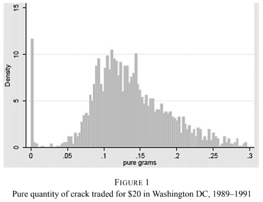


## Effects of Enforcement

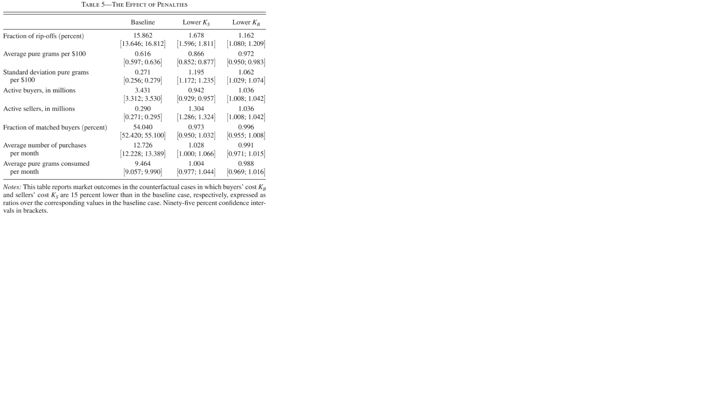{width=250%}

## Incarceration

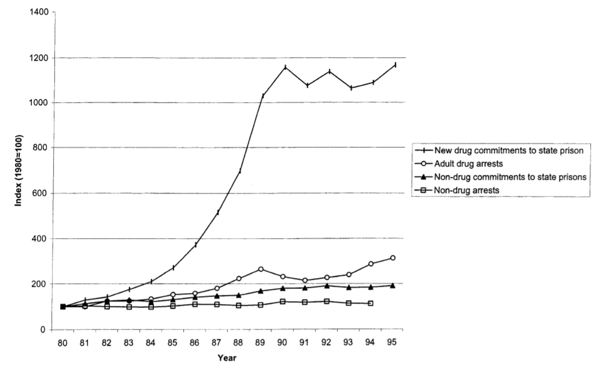

From 24,000 incarcerated in 1980 to 400,000 in 2000


## Incarcerating Buyers (1)

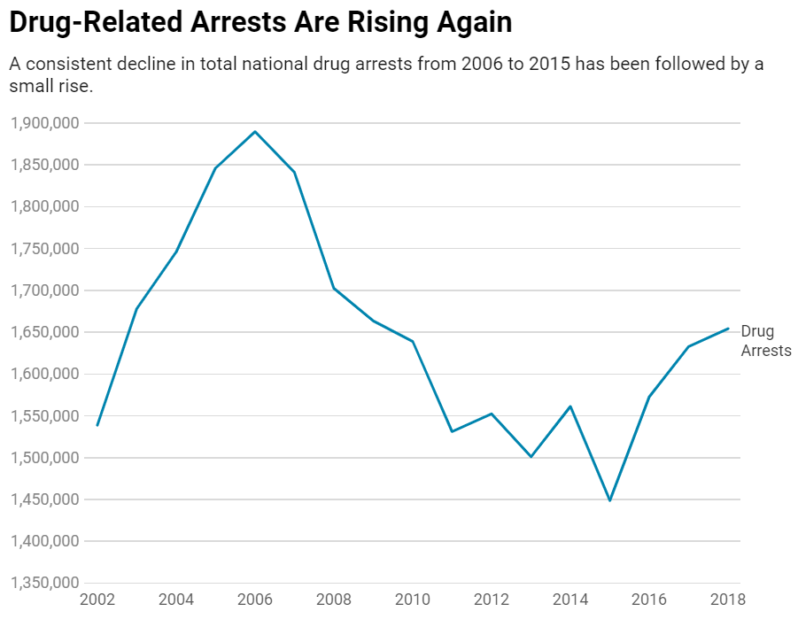

## Incarcerating Buyers (2)

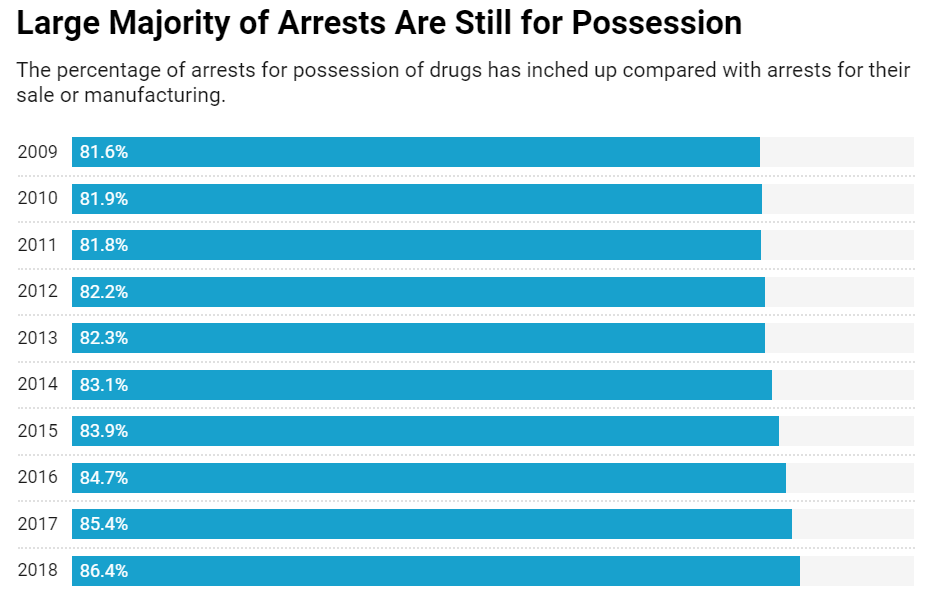

85 percent of incarcerations are for distribution (Kuziemko Levitt 2004)


## Is Incarcerating Buyers Effective?

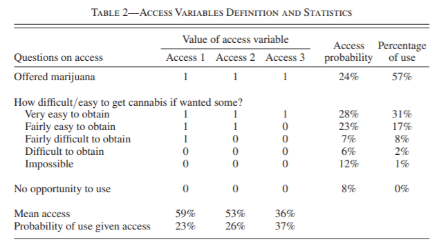

## Methamphetamine Suppression

In May 1995 a bill authorized the DEA to shut down firms producing ephedrine pills without justification (Dobkin and Nicosia 2009)

- Average price jumped from 30 dollars to 100 per gram
- Purity fell from 90 percent to 20
- Methamphetamine related hospital admissions dropped 50 percents and arrested individuals reporting use dropped 55 percent

Battery of tests suggest possible effect of an increase in robberies but authors urge caution.

## Supply Chain

- Global size of markets, 2009 [@UNODC2011]
	+ Opium: $68 billion
	+ Cocaine: $85 billion
	+ [iPhone Sales](https://www.statista.com/statistics/263402/apples-iphone-revenue-since-3rd-quarter-2007/): $165 billion (2018)

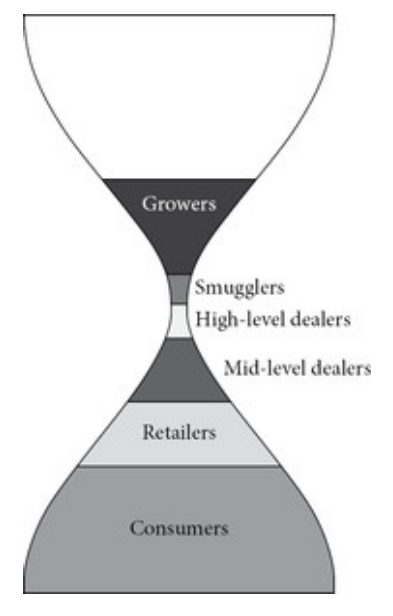{ width=30% }

## Cocaine

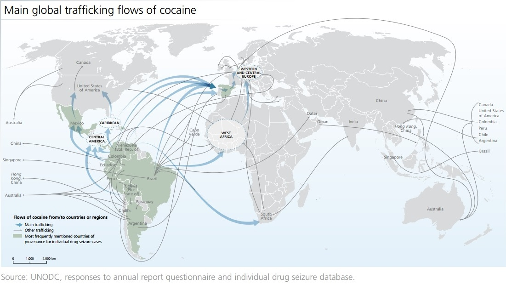

## Heroin

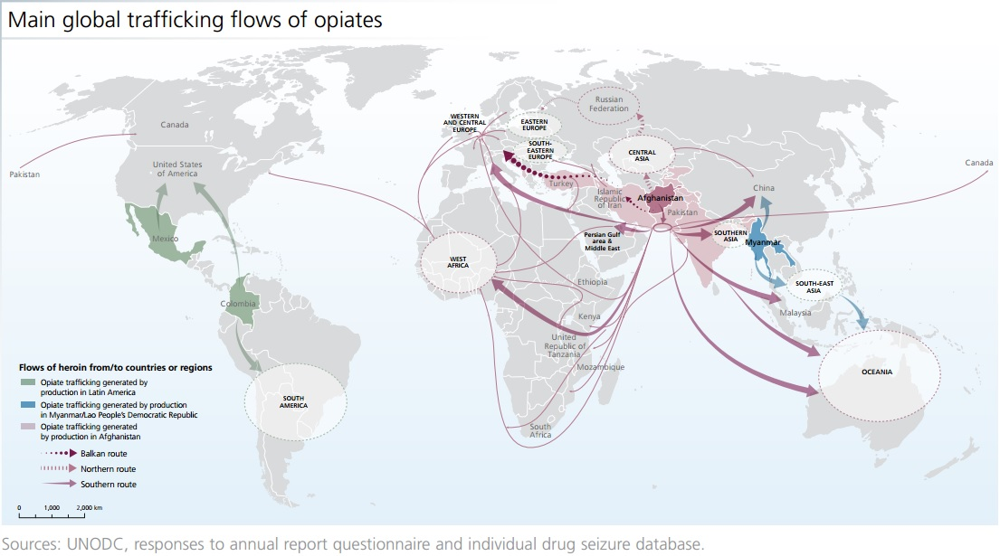

## Cost-Price Margins [@Reuter2010]

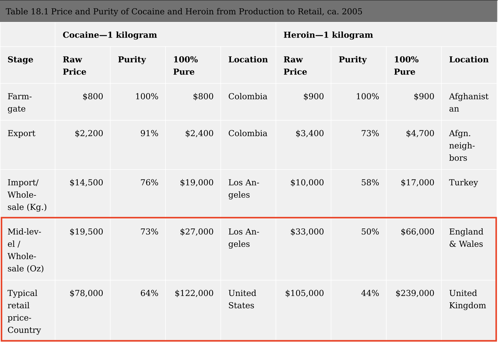

## Retailers - Street Gangs

> "Mexican DTOs and criminal groups are the principal transporters of illicit drugs into and through the Chicago HIDTA region" - DEA

> "Street gangs control most retail drug distribution in the [Chicago] and are increasingly exploiting relationships with other gangs or DTOs and use of technology to advance their criminal activities" - DEA

- Some involvement in production (e.g. converting powder to crack cocaine, repackaging)
- Non-economic operating expenses dominate...

## Operating Expenses

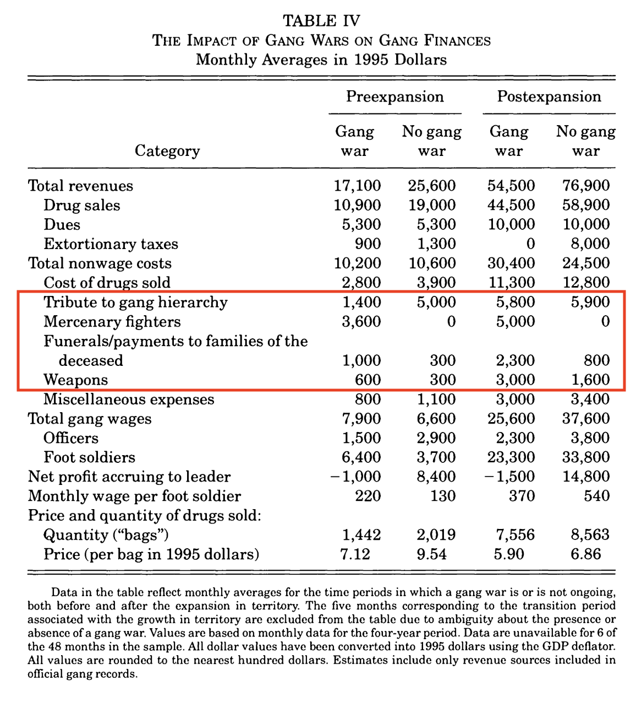

## Territoriality

> "If you want to expand your sales, you have to expand your street corners. You know, you have to physically take street corners, which is a violent act." - John Lippert, *Bloomberg Markets*

> "Because crack distribution generates significant profits for street gangs, low-level rival gang members routinely engage in violence to acquire turf or steal drugs or drug proceeds" - DEA

## Territoriality

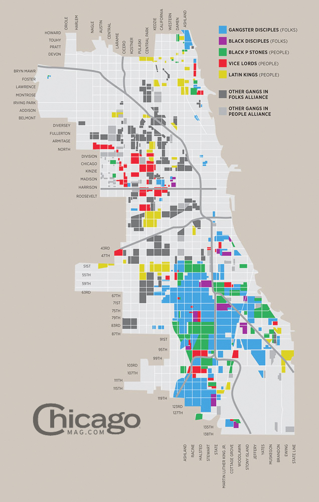

## Price and Violent Competition

**Gang Wars**

- @Levitt2000
	+ Gang wars occur about 25 percent of the time
	+ Gang wars result in 20-30 percent drop in prices and quantities sold
	+ Death rate (annual) for members: 7 percent
- @Papachristos2009
	+ 35 percent of homicides in 1994, 1998, 2002 documented as gang-related by homicide detectives
	+ 88 percent inter-gang

> "In 2006 nearly 50 percent of the homicides and a large percentage of other violent crimes and property crimes committed in Chicago were attributed to street gangs that are involved in drug trafficking" - DEA

**Law Enforcement and Imprisonment**

> "3,500 of the 13,000 inmates currently housed in the Cook County Jail have some gang affiliation" - DEA

- At any given time, 1/3 of gang leadership is imprisoned [@Levitt2000]

## Homicides and Non-Fatal Shootings

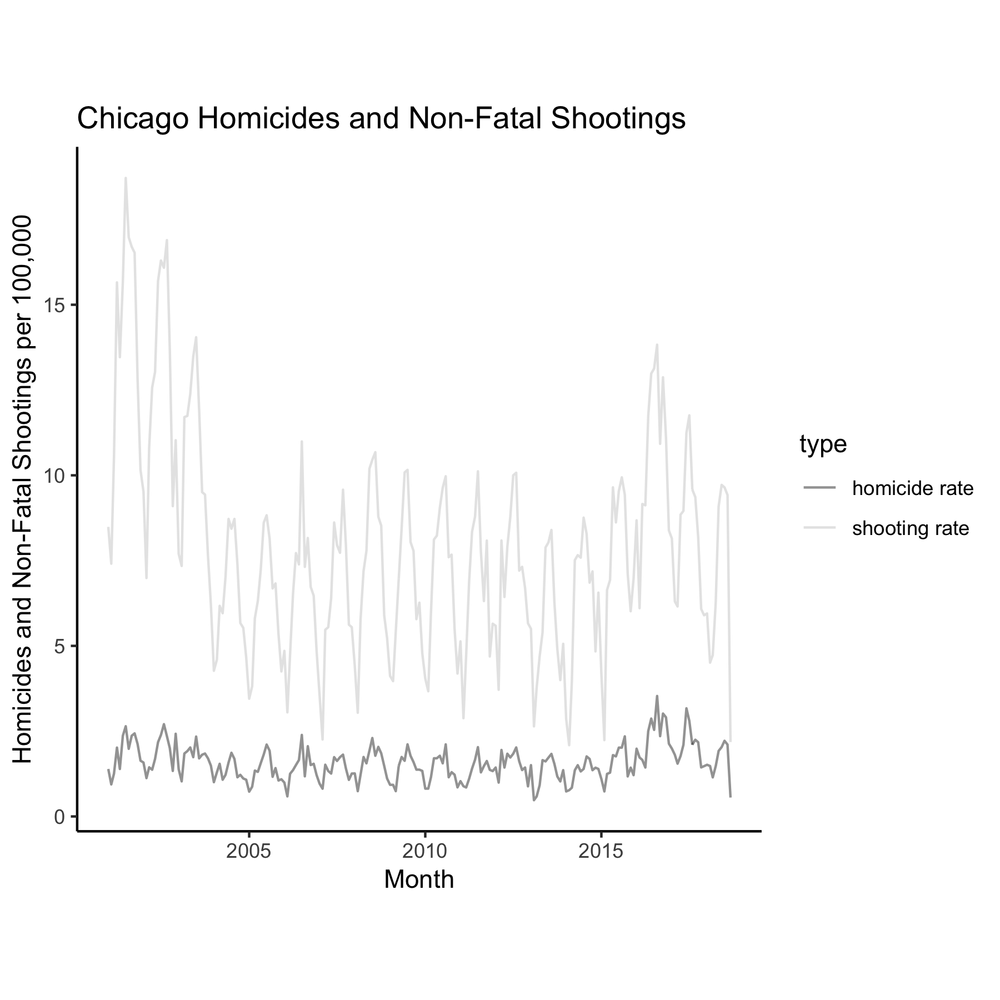

## Homicides and Non-Fatal Shootings

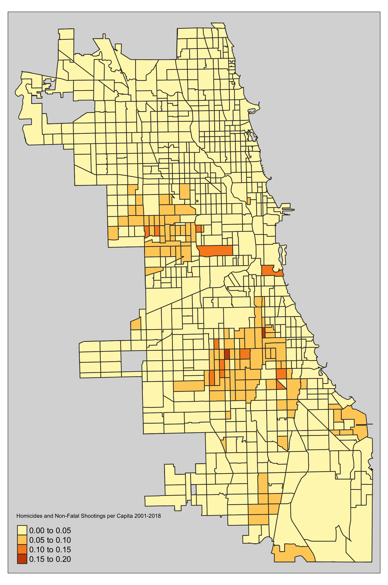

## Narcotics Arrests

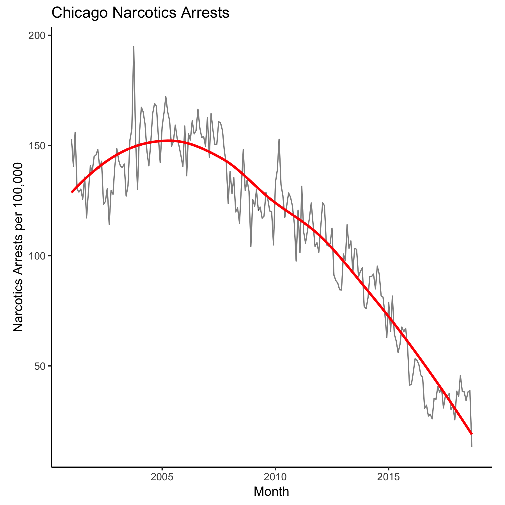

## Narcotics Arrests

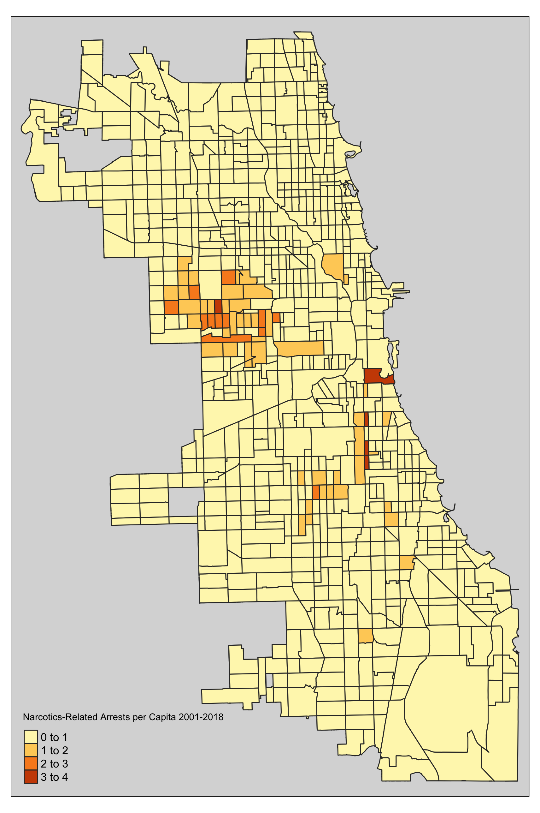

## Policing

Elasticity of Crime

- Police hiring (Levitt 1997, McCrary 2002, Chalfin and McCrary 2017)
- Terrorist attacks (Di Tilla and Schargrodsky 2004)
	- Police reduce car thefts by 75 percent on blocks.
	- Police exert no influence one or two blocks away.
- Terrorist attacks (Draca et al 2005)
	- Elasticity of crime with respect to policing of [-0.3,-0.4]
	- No spillover effects

Down-market effects

- Elections (Dell 2015)
	- Homicides increase by a factor of 5.5 (27-33) per annum
	- No large reduction in drug trade or consumption

Best Practices (Chalfin and McCrary 2017)

## Questions

**Labor Market for Retailers**

- If retail prices are so high, why are earnings for dealers so low?
- Why is compensation so low, given risk?

**Territoriality and Competition**

- Why is violence so uniquely associated with black markets?
- Violence versus prices as competitive means...complements or substitutes?
- Consumers presumably can travel quickly to different territories...what benefits does 'turf' bring if not market power?

**Policy**

- How would increased police enforcement (seizures or arrests) affect competition (price and violent) between groups?
- Radical counterfactual: drug legalization
	+ Tradeoff(?): violence versus consumption

## Sources

- Dobkin, Carlos and Nancy Nicosia. 2009. ``The War on Drugs: Methamphetamine, Publci Health, and Crime" \textit{AER} 99(1): 324-349.
- Galenianos, Manolis, and Alessandro Gavazza. 2017. ``A Structural Model of the Retail Market for Illicit Drugs" \textit{American Economic Review}: 858-896.
- Galenianos, Manolis, Rosalie Liccardo Pacula, Nicola Persico. 2012 ``A Search-Theoretic Model of he Retail market for Illicit Drugs" \textit{Review of Economic Studies} 79: 1239-1269.
\item Horowitz, Joel L., ``Should the DEA's STRIDE Data Be Used for Economic Analyses of Markets for Illegal Drugs?" \textit{JASA} 96(456): 1254-1271.
- Susan Stellin, ``Is the War on Drugs Over? Arrest Statistics Say No.", \textit{New York Times} Nov 5, 2019.
- https://www.nytimes.com/2019/11/05/upshot/is-the-war-on-drugs-over-arrest-statistics-say-no.html

## Sources (II)

- Jacobi, Liana, and Michelle Sovinsky. 2016. ``Marijuana on Main Street? Estimating Demand in Markets with Limited Access" \textit{AER}. 106(8): 2009-2045.
- Di Tella, Rafael, and Ernesto Schargrodsky. 2004. ``Do Police Reduce Crime? Estimates Using the Allocation of Police Forces after a Terrorist Attack." \textit{American Economic Review} 94(1): 115-133.
- Draca, Mirko, Stephen Machin, and Robert Witt. 2011. ``Panic on the Streets of London: Police, Crime, and the July 2005 Terror Attacks." \textit{American Economic Review}, 101(5): 2157-81.
- Dell, Melissa. 2015. ``Trafficking Networks and the Mexican Drug War." \textit{American Economic Review} 105(6): 1738-79.

## Sources (III)

- McCrary, Justin. 2002. ``Using Electoral Cycles in Police Hiring to Estimate the Effect of Police on Crime: Comment." \textit{American Economic Review} 92:4 (2002): 1236-1243.
- Levitt, Steven. 1997. ``Using Electoral Cycles in Police Hiring to Estimate the Effect of Police on Crime: Comment." \textit{American Economic Review} 87(3): 270-290. 
- Kuziemko, Ilyana, and Steven D. Levitt. 2004. ``An Empirical Analysis of Imprisoning Drug Offenders." \textit{Journal of Public Economics} 88(9-10): 2043-2066.
- Chalfin, Aaron, and Justin McCrary. 2017. ``Criminal Deterrence: A Review of the Literature." \textit{Journal of Economic Literature} 55(1): 5-48.

## References