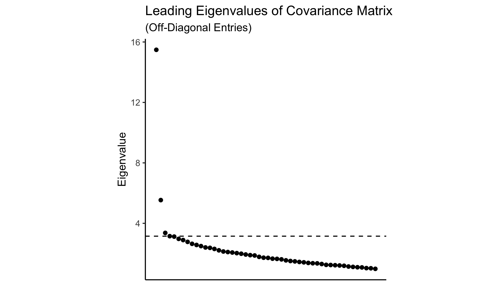
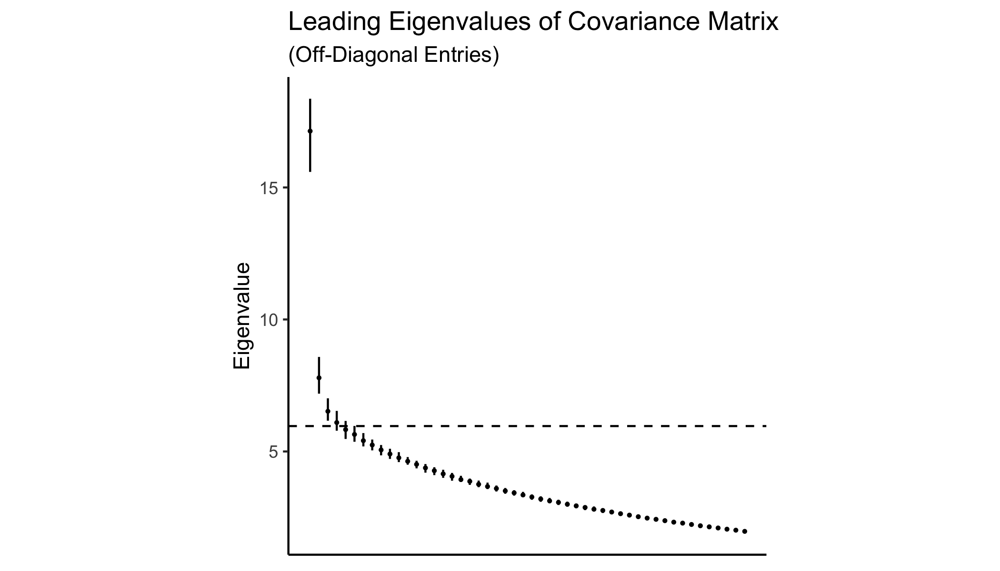

\newpage

# Introduction

In 2019, 2,110 people were murdered or shot in the city of Chicago. Chicago is far from the most violent American city on a per capita basis — other large municipalities confront alarmingly high rates of interpersonal violence.  Law enforcement agencies and researchers believe much of this violence is connected to street gangs and disputes amongst their members. Between 1994 and 2006, law enforcement officials classified 35-50 percent of Chicago homicides as gang-related [@Papachristos2009; @NDIC2007].^[@Papachristos2009 reports that homicide detectives classified 35 percent of homicides as gang-related in the years 1994, 1998, and 2002. A Department of Justice report claims that 50 percent of Chicago homicides in 2006 were gang-related. According to @Howell2018, these numbers are not unusual -- other large police departments classify between 20 and 50 percent of local homicides as gang-related.] Inter-gang warfare and intra-gang violence feature prominently alongside drug-dealing in many ethnographic accounts of street gangs and their operations [@Sanchez1991; @Decker1996; @Papachristos2009; @Vargas2016]. In one oft-cited case, a gang's monthly costs of protection and aggression —- hiring mercenaries, paying tribute, procuring weapons, and staging funerals —- dwarfed the wholesale costs of all drugs sold by its dealers [@Levitt2000].

Gangs operate over well-defined territories. Gangs mutually recognize one another's territories and extract rents on territories they control, through racketeering, drug-selling monopolies, and other criminal activity [@Thrasher1927; @Sanchez1991; @Levitt2000; @Venkatesh2000]. Gangs war with one another over control of these rent streams and in response to challenges to their individual or collective reputations [@Papachristos2013; @Ebdm2018]. Wars occur frequently [@Levitt2000]. Violent factional conflict within gangs also recurs, as members fight over access to the  privileges of leadership [@Papachristos2009].

Anecdotal accounts of gang violence and territoriality abound. Our knowledge of gangs and their territorial footprints remains largely anecdotal because gangs are necessarily covert organizations loathe to share information about their operations with outsiders. Law enforcement agencies do attempt to map gang activity, but rarely share this information with the public.^[The Chicago Police Department's gang maps are the most well-known and are available to researchers thanks to Freedom of Information requests by @Bruhn2019.] Still, the data produced by such efforts are subject to well-known biases [@Kennedy1996; @Levitt1998; @Carr2016]. Existing open-source methodologies used to estimate gangs' territorial footprints require deep subject matter expertise that make them difficult to generalize beyond their target locale [@Sobrino2019; @Melnikov2019; @Signoret2020].

In this paper, we propose and implement a method to estimate the number of gangs operating in a given location and their territorial footprints. Our approach requires the analyst observe only the location and timing of all (gang-related and non-gang related) violent events within the area under study — data that are widely available in administrative records on crime. We apply this method to study gangs in Chicago, a city in which a panel of gang maps produced by the Chicago Police Department (CPD) are publicly available [@Bruhn2019]. We are able to detect the presence of 3 gangs, whose estimated territorial footprints correspond roughly to those of the Gangster Disciples, the Latin Kings, and the Vice Lords. While these constitute a small fraction of all gangs operating in Chicago, they are among the largest by membership and territorial extent. Together, these gangs own XX percent of all gang turf in the city, according to CPD maps. 

We begin by modeling the data-generating process for violent events. These fall into three categories: inter-gang, intra-gang, and non-gang. Gangs are assigned to territories according to an unobserved partition function. Period-specific shocks induce territorially-circumscribed conflict between and within gangs. Non-gang violence exhibits no spatial correlation. We show that this model generates a distinct pattern of spatial covariance in violent events. We prove that under our model, the spatial covariance in violence is a sufficient statistic for the underlying territorial partition. The model follows closely that of @Trebbi2019. Our innovation is to generalize their approach, used to study terrorist groups in Afghanistan and Pakistan, to a setting featuring bilateral conflict between violent organizations. 

We estimate the model on the observed spatial covariance in homicides and non-fatal shootings across Census tracts in Chicago from 2004-2017. Our data come from victim-based crime reports from the Chicago Police Department. We estimate the number of gangs and the territorial partition in sequence. We estimate the number of gangs by iteratively fitting the model, holding this quantity fixed, until out-of-sample fit ceases to improve. We proceed to estimate the territorial partition using spectral clustering [@Luxberg2007], following @Lei2015. This returns the set of census tracts belonging to each gang, as well as the "peaceful" set of territories in which no gang operates. It also produces estimates for the parameters relating to the intensity of between- and within-group conflict. We quantify our uncertainty surrounding the territorial partition and these parameters through non-parametric bootstrap, sampling the set of homicides and non-fatal shootings with replacement and re-estimating the territorial partition, holding the number of gangs fixed. 

We permute our most-likely census tract labels to best-approximate a smoothed (over time) map of gang territories and peaceful tracts produced by the CPD. We then compare our estimated partition to the CPD gang maps. Our labels agree with those of the CPD in XX percent of tracts overall. Among tracts the CPD classifies as gang-occupied, we assign XX percent to the same gang.

The paper proceeds as follows. We first briefly review the substantive and methodological literature upon which our paper builds. We then describe the crime data and CPD gang maps, used for estimation and validation, respectively. Section IV introduces our model and derives the spatial covariance structure used for estimation. We develop our estimators for the number of gangs and the territorial partition in Section V. We present our results and validate them on the CPD gang maps in Section VI before concluding. 

# Literature

# Data

# Model

## Primitives and Assumptions

There are $N$ districts in the city ($i, j \in \mathcal{N} = \left\{1, ..., N \right\}$). $r_i$ residents live in each district. The city is also inhabited by $K$ gangs ($k, \ell \in \mathcal{K} = \left\{1, ..., K \right\}$). Each gang is endowed with a $m_k$ soldiers. A partition function $\pi : \mathcal{N} \rightarrow \left\{ 0, \mathcal{K} \right\}$ assigns territories to the gangs that control them, where $\pi(i) = 0$ indicates the absence of any gang activity. $\mathcal{N}_k$ is the set of territories controlled by gang $k$ and $n_k = | \mathcal{K}_k |$ the number of territories controlled by gang $k$. The set of unoccupied territories is $\mathcal{K}_0$. We are interested in estimating the number of groups, $K$, and the territorial partition, $\pi$.

We observe data on geo-located shootings for $T$ periods, indexed $\left\{ 1, ..., T \right\}$. We hold the above quantities constant over time. There are three types of shootings that occur in the city -- inter-gang, intra-gang, and non-gang. Let $y_i^t$ denote non-gang related shootings in district $i$ during period $t$ and $x_i^t$ denote gang-related shootings in the same district-period. Non-gang shootings are committed by residents with probability $\eta_i$ and are independent across districts. Then, the expected number of shootings in district $i$ is $\eta_i r_i$ with variance $\psi_i = \eta_i (1 - \eta_i) r_i$.^[In other words, non-gang shootings are distributed i.i.d. binomial.]
  
Gang-related shootings are determined by the geographic distribution of gang activity and the state of relations between and within gangs. We assume the probability a given soldier from gang $k$ is operating in territory $i$ is constant and given by $n_k^{-1}$. Members of the same gang sometimes commit violence against one another. The probability a member of gang $k$ shoots a member of his own gang during period $t$ is given by $\xi_k^t$. Assumption 1 states that the expected likelihood of such violence is non-zero.

**Assumption 1:** $\E [ \xi_k^t ] > 0$ for all $k \neq 0$ and $\xi_0^t = 0$ for all $t$.

We also assume that conflict within gangs is unrelated to within-gang conflict between other gangs.

**Assumption 2:** $\E [ \xi_k^t \xi_{\ell}^t ] - \E [ \xi_k^t ] \E [ \xi_{\ell}^t ] = 0$ for all $k \neq \ell$.

We impose no other restrictions on the distribution of intra-gang shocks. The possibility of intra-gang violence allows us to distinguish between territories owned by the same gang and territories whose owners exclusively war with one another.^[Alternatively, we could assume that gangs fight at least two other groups with positive probability. We view this assumption as less restrictive.]

Gangs also war with one another with varying intensity. The probability a member of gang $k$ shoots a member of gang $\ell$ during period $t$ is $\epsilon_{k \ell}^t$. We make two assumptions on the distribution of these inter-gang shocks. First, we assume they are quasi-symmetric. This requires that any increase in the likelihood that members of gang $k$ shoot members of gang $\ell$ is accompanied by a proportionate increase in reciprocal violence. Notably, we allow this retaliation propensity to vary at the level of the gang but not the gang-dyad.

**Assumption 3:** $c_{k} \epsilon_{k, \ell}^t = c_{\ell} \epsilon_{\ell, k}^{t}$ with the normalization $c_1 = 1$. If $k = 0$ or $\ell = 0$ then $\epsilon_{k, \ell}^t = 0$ for all $t$.

Second, we assume inter-gang shocks are independent across gang dyads.^[Of course, the intensity of conflict between any two gangs is almost certainly affected by the broader conflict environment. This assumption is made for purposes of model tractability. In future work, we plan to model the genesis of conflict shocks and perhaps relax this assumption.]

**Assumption 4:** $\E \left[ \epsilon_{k, \ell}^t \epsilon_{m, n}^t \right] - \E \left[ \epsilon_{k, \ell}^t  \right] \E \left[ \epsilon_{m, n}^t \right] = 0$ for $m, n \notin \left\{ k, \ell \right\}$.

The expected number of gang-related shootings in district $i$ during period $t$ can then be calculated as 
$$
\E [ x_i^t ] = \underbrace{ \frac{m_{\pi(i)}}{n_{\pi(i)}} \E [ \xi_{\pi(i)}^t ]}_{ \text{intra-gang} } + \underbrace{\sum_{k \neq \pi(i)} \frac{m_k}{n_{\pi(i)}}  \E [ \epsilon_{k, \pi(i)}^t ]}_{ \text{inter-gang} }
$$
The total number of shootings in district $i$ during period $t$ is
$$
v_i^t = x_i^t + y_i^t
$$

## Covariance Structure

In the proceeding section we will show that the covariance in shootings across districts is informative about the number of groups and the territorial partition. Let $a_{ij} = \Cov [ v_i^t, v_j^t ]$ Proposition  1 describes the covariance structure of our model. A derivation of this quantity can be found in Appendix A.

**Proposition 1:** The covariance in shootings between districts $i$ and $j$ is
$$
a_{ij} = \begin{cases} \sum_{k \neq \pi(i)} \left( 
\left( \frac{m_k}{n_{\pi(i)}} \right)^2 \Var [  \epsilon_{\pi(i), k}^t ] \right) +  \left( \frac{m_{\pi(i)}}{n_{\pi(i)}} \right)^2 \Var[ \xi_{\pi(i)}^t ] + \psi_i & \text{if } i = j \\
\sum_{k \neq \pi(i)} \left( 
\left( \frac{m_k}{n_{\pi(i)}} \right)^2 \Var [ \epsilon_{\pi(i), k}^t ] \right) +  \left( \frac{m_{\pi(i)}}{n_{\pi(i)}} \right)^2 \Var[ \xi_{\pi(i)}^t ] & \text{if } \pi(i) = \pi(j) \\
\frac{m_{\pi(i)}}{n_{\pi(j)}} \frac{m_{\pi(j)}}{n_{\pi(i)}} \frac{c_{\pi(j)}}{c_{\pi(i)}} \Var [\epsilon_{\pi(i), \pi(j)}^t] & \text{if } \pi(i) \neq \pi(j) \\
0 & \text{otherwise}
\end{cases}
$$

Corollary 1 states that violence will covary constantly for all pairs of districts controlled by the same gang.

**Corollary 1 (Block Structure):** 

1. If $\pi(i) = \pi(j) = k$ and $i \neq j$ then $a_{ij} = b_{kk}$ constant for all $i, j$.
2. If $\pi(i) = k$ and $\pi(j) = \ell$ with $\ell \neq k$ then $a_{ij} = b_{k \ell}$ constant for all $i, j$.

Let $A_{N \times N} = (a_{ij})_{ \left\{ i,j \in \mathcal{N} \right\} }$ be the covariance matrix.^[Note also that this matrix is symmetric and positive definite.] Let $A(k, \ell)_{n_k \times n_\ell} = (a_{ij})_{ \left\{ i,j | \pi(i) = k, \pi(j) = \ell \right\} }$ be the submatrix where the row districts are controlled by $k$ and the column districts are controlled by $\ell$. If the partition function $\pi$ is known then the rows and columns of this matrix can be permuted to reveal the block structure described in Corollary 1. To reveal the block structure, we rearrange district identifiers in accordance with their territorial assignment. Let $f$ be a bijection that maps $\mathcal{N}$ to itself. Specifically, 
$$
f: \begin{cases}
\mathcal{K}_k \rightarrow \left\{ \sum_{\ell=1}^{k-1} ( n_{\ell} ) + 1, \dots, \sum_{\ell=1}^{k} ( n_{\ell} ) \right\} & \text{if } k \geq 1 \\
\mathcal{K}_0 \rightarrow \left\{ \sum_{\ell=1}^{K} ( n_{\ell} ) + 1, \dots, N \right\} & \text{if } k = 0
\end{cases}
$$
Then, let $P_{N \times N} = (p_{ij})_{ \left\{ i, j \in \mathcal{N} \right\} }$ be a permutation matrix with $p_{ij} = 1$ if $f(i) = j$ and $p_{ij} = 0$ otherwise. Let $\bar{A} = P A P$ denote the permuted covariance matrix. Then, 
\vspace{5mm}
$$
\footnotesize \bar{A} = \begin{bNiceArray}{CCCCC}
\overmat{\pi(i) = 1}{\begin{bmatrix}
    & & \\
    & A(1, 1)_{n_1 \times n_1} & \\
    & & 
\end{bmatrix}} & \overmat{\pi(i) = 2}{\begin{bmatrix}
    & & \\
    & A(1, 2)_{n_1 \times n_2} & \\
    & & 
\end{bmatrix}} & \cdots & \overmat{\pi(i) = K}{\begin{bmatrix}
    & & \\
    & A(1, K)_{n_1 \times n_K} & \\
    & & 
\end{bmatrix}} & \bm{0} \\
\begin{bmatrix}
    & & \\
    & A(2, 1)_{n_2 \times n_1} & \\
    & & 
\end{bmatrix} & \begin{bmatrix}
    & & \\
    & A(2, 2)_{n_2 \times n_2} & \\
    & & 
\end{bmatrix} & \cdots & \vdots & \bm{0} \\
\vdots & \vdots & \ddots & \vdots & \bm{0} \\
\begin{bmatrix}
    & & \\
    & A(K, 1)_{n_K \times n_1} & \\
    & & 
\end{bmatrix} & \cdots & \cdots & \begin{bmatrix}
    & & \\
    & A(K, K)_{n_K \times n_K} & \\
    & & 
\end{bmatrix} & \bm{0} \\
\bm{0} & \bm{0} & \bm{0}  & \bm{0} & \undermat{\pi(i) = 0}{
\begin{bmatrix}
    & & \\
    & A(0, 0)_{n_0 \times n_0} & \\
    & & 
\end{bmatrix}}
\end{bNiceArray}
$$
\vspace{5mm}

Figure \ref{fig:blocks} shows a schematic representation of this permutation. In the right column blocks and bottom row blocks are districts that are not controlled by any gang. These exhibit no covariance with other districts because the only shootings that occur there are from residents, and these are i.i.d. across districts. Along the block-diagonal are districts owned by the same gang. Shootings within a gang's territory covary for two reasons. First, shocks to within-gang relations ($\xi_k^t$) are shared by all districts controlled by a given gang. Second, members of gang $k$ operating in these districts share equally the risk of attacks that comes from *all* gang wars in which $k$ is a belligerent ($\epsilon_{k, \ell}^t$). On the off block-diagonal are covariances produced through *specific* gang wars. For example, $k, \ell$ block of the matrix is positive whenever $\E [ \epsilon_{k, \ell}^t ] > 0$, or there is a positive probability of conflict between gangs $k$ and $\ell$. These reason that shootings in the districts controlled by gangs $k$ and $\ell$ covary is because inter-gang shocks generate retaliatory violence (Assumption 3).

This covariance matrix can be compactly represented as a function of our estimands, $K$ and $\pi$. Let $\Psi = \text{diag}(\psi_1, \dots \psi_N)$ and $Q = A - \Psi$. Let $B_{K + 1 \times K + 1} = (b_{k \ell})_{ \left\{ k, \ell \in \mathcal{K} \right\} }$ store the constant block covariance values defined in Corollary 1 and note that $b_{k0} = 0$ for all $k$. Finally, let $\Theta_{N \times K + 1} = (\theta_{ik})_{\left\{ i \in \mathcal{N}, k \in \mathcal{K} \cup 0 \right\} }$ be a membership matrix with $\theta_{ik} = 1$ if $\pi(i) = k$ and $0$ otherwise. Then, 
$$
Q = \Theta B \Theta^T
$$.

Readers may recognize this structure as similar in form to a stochastic blockmodel [@Holland1983]. In such models, nodes are partitioned into groups and interact with members of other groups with some latent probability determined by their group membership. These latent probabilities can be expressed in a *connectivity matrix* akin to our $B$. If counts of these interactions are observed, the partition function and connectivity matrix can be estimated using spectral clustering [@Jin2015; @Lei2015].

Here, we do not observe directly these interactions, and our $B$ matrix does not have this simple interpretation. However, under the assumptions of our model, the spatial covariance in shootings mirrors the structure of the stochastic blockmodel, as in @Trebbi2019. We can therefore employ existing methods to estimate our model using these data. 

# Estimation

We will first show how to estimate the territorial partition, described by the matrix $\Theta$, holding the number of groups, $K$, fixed. We will then proceed to estimate $K$ using cross validation, following @Chen2018. Let $J = K + 1$ for convenience.

## Territorial Partition

We observe the sample analogue to $A$,
$$
\tilde{A} = \E [A] + \Phi
$$
where $\Phi = (\phi_{ij})_{ \left\{ i, j \in \mathcal{N} \right\} }$ is a noise matrix with $\E[\phi_{ij}] = 0$ for all $i, j$. Note that
\begin{align*}
Q - \text{diag}(Q) &= \E[A] - \text{diag}(\E[A]) \\
&= \tilde{A} - \Phi - \text{diag}(\E[A]) \\
\Phi - \text{diag}(\Phi) &= \left( \tilde{A} - \text{diag}(\tilde{A}) \right) - \left( Q - \text{diag}(Q) \right)
\end{align*}

Let $\mathbb{R}_{+}^{J \times J}$ be the set of all $J \times J$ symmetric matrices with non-negative entries, $\mathbb{D}^{J \times J}$ be the set of all $J \times J$ diagonal matrices and let $\mathbb{M}^{N \times J}$ be the set of all membership matrices.^[These have binary entries with rows summing to 1.] A moment estimator for $\Theta$ and $B$ satisfies
\begin{equation} \label{eq:estimator}
(\hat{\Theta}, \hat{B}) = \argmin_{B \in \mathbb{R}^{J \times J}, \Theta \in \mathbb{M}^{N \times J}} \lVert \Phi - \text{diag}(\Phi) \rVert_F
\end{equation}
where $\lVert M \rVert_F = \left( \sum_{i} \sum_j M_{ij}^2 \right)^{\frac{1}{2}}$ is the Frobenius norm.

We estimate these quantities using spectral clustering.^[@Luxberg2007 provides an overview of this family of methods.] These methods exploit the eigen-structure of $Q$. If there are $K$ gangs in the city, $Q$ will have $J$ nonzero eigenvalues. Let $\Delta = \text{diag}(\sqrt{n_1}, \dots, \sqrt{n_{J}})$ so that $\Delta B \Delta$ normalizes the connectivity matrix by the number of territories controlled by each group. $Q$ can then be written as
\begin{align*}
Q &= \Theta B \Theta^T \\
&= \Theta \Delta^{-1} \Delta B \Delta \Delta^{-1} \Theta^T \\
&= \Theta \Delta^{-1} Z \Lambda Z^T \Delta^{-1} \Theta^T \\
&= \Theta X \Lambda X^T \Theta^T
\end{align*}
following @Lei2015 (Lemma 2.1), where $\Lambda = \text{diag}(\lambda_1, ..., \lambda_{J})$ stores the nonzero eigenvalues of the normalized connectivity matrix with $| \lambda_1 | \geq \dots \geq | \lambda_{J} | > 0$ and $Z_{N \times J}$ stores the associated eigenvectors. Therefore, $Z \Lambda Z^T = \Delta B \Delta$ is the eigendecomposition of the normalized connectivity matrix. Because $\Theta \Delta^{-1}$ is an orthonormal matrix, the rows of $\Theta X$ remain orthogonal and $Q = U \Lambda U^T$ is an eigendecomposition of $Q$ with $U = \Theta X$.

The noise matrix $\Phi$ will distort the eigenvalues of $\tilde{A}$ away from zero. As $T \rightarrow \infty$, however, this noise matrix becomes small and the eigenvalues that take nonzero values due to noise will shrink toward zero. We therefore eigendecompose $\tilde{A} - \text{diag}(\tilde{A})$ into
$$
\tilde{A} - \text{diag}(\tilde{A}) = \tilde{U} \tilde{\Lambda} \tilde{U}^T
$$
with $\tilde{\Lambda} = \text{diag}(\tilde{\lambda}_1, \dots, \tilde{\lambda}_{J})$ and $| \tilde{\lambda}_1 | \geq \dots \geq | \tilde{\lambda}_{J} | >  | \tilde{\lambda}_i |$ for $i \notin \left\{ 1, \dots, J \right\}$. Then, the problem in \ref{eq:estimator} can be reformulated as
\begin{align*}
\left( \hat{\Lambda}, \hat{X}, \hat{\Theta} \right) &= \argmin_{ \Lambda \in \mathbb{D}^{J \times J}, X \in \mathbb{R}^{J \times J}, \Theta \in \mathbb{M}^{N \times J} } \lVert \tilde{U} \tilde{\Lambda} \tilde{U}^T - \left( \Theta X \Lambda X^T \Theta^T - \text{diag}(Q) \right) \rVert_F \\
&\approx \argmin_{ \Lambda \in \mathbb{D}^{J \times J}, X \in \mathbb{R}^{J \times J}, \Theta \in \mathbb{M}^{N \times J} } \lVert \tilde{U} \tilde{\Lambda} \tilde{U}^T - \Theta X \Lambda X^T \Theta^T \rVert_F
\end{align*}

Setting $\hat{\Lambda} = \tilde{\Lambda}$, the problem reduces to
\begin{equation} \label{eq:kmeans}
\left( \hat{X}, \hat{\Theta} \right) = \argmin_{ X \in \mathbb{R}^{J \times J}, \Theta \in \mathbb{M}^{N \times J} } \lVert \Theta X - \tilde{U} \rVert_F
\end{equation}
which can be solved via K-means clustering on the leading eigenvectors of $\tilde{A} - \text{diag}(\tilde{A})$ where $\Theta$ are the cluster memberships and $X$ are the cluster centroids. An estimate for $B$ can then be recovered as
\begin{equation} \label{eq:B}
\hat{B} = \hat{X} \hat{\Lambda} \hat{X}^T
\end{equation}

Shootings in districts without gangs will exhibit no covariance in expectation with shootings in districts in which gangs operate, $\E[ b_{0k} ] = 0$ for all $k \neq 0$. Once we have estimated $B$, we can therefore isolate the cluster corresponding to no gang activity by finding the row of $\hat{B}$ with the smallest values, formally
\begin{equation} \label{eq:nc}
\min_{ k \in \left\{ 1, ..., J \right\} } \lVert ( \hat{B} - \text{diag}(\hat{B}) )^{(k)} \rVert_2
\end{equation}
where $M^{(k)}$ is the $k$th row of $M$ and $\lVert M^{(k)} \rVert_2$ is the Euclidean vector norm. 

As discussed in the previous section, our model differs slightly from the stochastic block model. Where we observe between district covariance matrix, these models instead work with a binomial matrix of interaction counts between nodes (districts). Efforts to prove the consistency of spectral estimators therefore derive asymptotics as the number of nodes grows large.^[@Lei2015, for example, show that the spectral estimator is approximately consistent for $\Theta$. As the number of groups grows large, the estimator misclassifies a vanishing proportion of nodes with probability approaching one.] Intuitively, the off-diagonal entries of our empirical covariance matrix converge to the off diagonal entries of $Q$ as $T$ grows large. In the limit, then $\tilde{U} \rightarrow \Theta X$ and K-means should not have trouble isolating distinct clusters in $\tilde{U}$. We rely on this heuristic for esimation, as in @Trebbi2019.

## Number of Gangs

We rely on the cross-validation approach described in @Chen2018 to estimate the number of gangs operating in the city. For each trial $\tilde{K}$, this method iteratively splits the covariance matrix into $V$ rectangular subsets for testing. It then estimates $\Theta$ and $B$ on $V - 1$ subsets and calculates the predictive loss on the square subset of the covariance matrix held out for testing. The $\tilde{K}$ that minimizes predictive loss is chosen as $\hat{J} = \hat{K} + 1$. @Chen2018 provide no theoretical guarantees against overestimating $J$ and in practice, we find that predictive loss stochastically decreases as $\tilde{K}$ grows larger. We therefore select the first $\tilde{K}$ for which predictive loss does not decrease for $\tilde{K} + 1$ as our estimate for $\hat{J}$, averaged over many trial runs of the estimator. Let $\bar{L}_{\tilde{K}}(\tilde{A})$ be the average predictive loss on $\tilde{A}$ when $J = \tilde{K}$ and let $\delta = \left\{ \delta_1, \dots, \delta_{\bar{K}} \right\}$ be a sequence of changes in the predictive loss where $\delta_k = \bar{L}_{k}(\tilde{A}) - \bar{L}_{k+1}(\tilde{A})$. Our estimator for $J$ selects
\begin{equation} \label{eq:hatJ}
\hat{J} = \argmin_{k} \left\{ k \mid \delta_k < 0 \right\}_{k \in \left\{ 1, \dots, \bar{K} \right\} }
\end{equation}

We now describe how this loss function is constructed. Let $\mathcal{V} = \left\{ 1, \dots, V \right\}$ be the set of $V$ cross validation folds, $\mathcal{N}_v \subset \mathcal{N}$ disjoint sets with $\cup_{v \in \mathcal{V}} \mathcal{N}_v = \mathcal{N}$, and $\mathcal{N}_{-v} = \cup_{u \neq v \in \mathcal{V}}$. Let $M^{(u,v)}$ denote the submatrix of $M$ consisting of the rows in $u$ and the columns in $v$. 

We can construct estimates for $\Theta$ from a rectangular subset of $\tilde{A}$, $\tilde{A}^{(\mathcal{N}_{-v}, \mathcal{N})}$. As shorthand, let $\tilde{A}^{(-v, v)} = \tilde{A}^{(\mathcal{N}_{-v}, \mathcal{N})}$. Then,
$$
Q^{(-v, v)} = \Theta^{(-v, v)} B \Theta
$$
and
\begin{align*}
\left( Q^{(-v, v)} \right)^T Q &= \Theta B^T \left( \Theta^{(-v, v)} \right)^T \Theta^{(-v, v)} B \Theta^T \\
&= \Theta B^T \left( \Delta^{(-v, -v)} \right)^2 B \Theta^T
\end{align*}.
An eigendecomposition of this matrix (whose eigenvectors are the right singular vectors of $Q^{(-v, v)}$) can be clustered as above to produce estimates for $\Theta$, which we'll call $\hat{\Theta}(v)$. Then, we can construct $\hat{B}(v)$ by averaging over off-diagonal values of the clusters of the rectangular covariance matrix (excluding the rows in $\mathcal{N}_v$) 
$$
\hat{B}_{k, \ell} = \begin{cases}
\frac{ \sum_{i \in \hat{\mathcal{N}}_{-v, k}, j \in \hat{\mathcal{N}}_{\ell} } \tilde{A}_{ij} }{ \hat{n}_{v, k} \hat{n}_{\ell}} & \text{if } k \neq \ell \\
\frac{ \sum_{i, j \in \hat{\mathcal{N}}_{-v, k}, i \neq j} A_{ij} + \sum_{i \in \hat{\mathcal{N}}_{-v, k}, j \in \hat{\mathcal{N}}_{v, k} } A_{ij} }{ (\hat{n}_{-v, k} - 1) \hat{n}_{-v, k} + \hat{n}_{-v, k} \hat{n}_{v, k} } & \text{if } k = \ell
\end{cases}
$$
as in @Chen2018 Equation 5. Now we can create predicted values for $A$ where
$$
\hat{A}(v) = \hat{\Theta}(v) \hat{B}(v) \left( \hat{\Theta}(v) \right)^T
$$
The predicted loss for the held out block of the covariance matrix can then be calculated as
$$
L_v(\tilde{A}, \hat{A}(v)) = \left\lVert \left( \tilde{A}^{(v,v)} - \text{diag}(\tilde{A}^{(v,v)}) \right) - \left( \hat{A}(v)^{(v,v)} - \text{diag}(\hat{A}(v)^{(v,v)}) \right) \right\rVert_F
$$
The average loss for a trial value $\tilde{K}$ is then
$$
\bar{L}_{k}(\tilde{A}) = \frac{1}{V} \sum_{v=1}^V L_v(\tilde{A}, \hat{A}(v))
$$
. A sequence $\delta$ can then be constructed for values of $k \in \left\{ 1, ..., \bar{K} \right\}$ allowing us to implement our estimator for $J$ (Equation \ref{eq:hatJ}).

To summarize, our cross validation algorithm proceeds as follows:

1. For each $k \in \left\{ 1, ..., \bar{K} \right\}$,
	- Randomly split districts into folds $\mathcal{N}_1, \dots, \mathcal{N}_V$.
	- For each fold, estimate $\hat{\Theta}(v)$ and $\hat{B}(v)$.
	- For each fold, calculate the predictive loss on $\tilde{A}^{(v,v)}$, $L_v(\tilde{A}, \hat{A}(v))$
	- Average the predictive loss across folds, $\bar{L}_{k}(\tilde{A})$.
2. Construct the sequence of changes in predictive loss, $\delta$.
3. Select $\hat{J}$ using Equation \ref{eq:hatJ}.

In practice, we repeat this algorithm many times and choose the most frequent value for $\hat{J}$ as our estimate.

An alternative set of approaches to estimating $J$ exploit the intuition discussed in the preceding subsection regarding the eigenvalues of $\tilde{A} - \text{diag}(\tilde{A})$. As $T \rightarrow \infty$, the eigenvalues associated with noise shrink toward zero while those associated with clusters remain positive. This generates a "eigengap" between the eigenvectors associated with true clusters and those associated with noise. @Ahn2013 investigate this inuition and construct an estimator for the number of factors in a similar class of models. In the next section, we show that this "eigengap" presents near our estimate for $\hat{J}$, consistent with this intuition.

# Results

We detect the presence of 3 gangs in Chicago. Figure \ref{fig:scree} displays the 50 eigenvalues of the covariance matrix of shootings across census tracts. The first several eigenvalues stand out from the remainder, indicative of the presence of unique clusters of gang activity in the data.

These clusters are easily visualized by examining the permuted covariance matrix, the empirical equivalent to Figure \ref{fig:blocks}. This can be seen in Figure \ref{fig:block_hm}. Each square on the right panel highlights the districts controlled with a single gang, with the bottom right block corresponding to districts estimated to have no gang activity. Gang wars generate positive covariance in the off-block diagonal entries. Darker off-block-diagonal entries indicate more intense conflict between the gangs controlling the pairs of districts in question. 

Figure \ref{fig:map} shows the distribution of gang territory in the Chicago. Like the distribution of shootings, gang activity is concentrated in the south and west of the city. Large tracts of the central and northern parts of the city are estimated to be devoid of gang activity. Gangs territories are somewhat locally compact, consistent with data published by the Chicago Police. However, some neighborhoods of the city are quite contested. All of the gangs we detect operate in both the southern and western of the city.

So far, we have focused on our results for the esimated partition function, $\hat{\pi}$. Our estimates for $\hat{B}$ describe the intensity of conflict between gangs in our sample. Figure \ref{fig:Bhat_hm} displays the magnitudes of these conflict intensities. 

## Validation on Chicago Police Department Gang Maps

*In progress...*

# Conclusion

\clearpage

# Appendices

## Appendix A: Covariance Derivation

\begin{align*}
\Cov [v_{it}, v_{jt}] =& \E [v_{it} v_{jt}] - \E [v_{it}] \E [v_{jt}] \\
=& \E [ (x_{it} + y_{it}) (x_{jt} + y_{jt}) ] - \E [ x_{it} + y_{it} ] \E [ x_{jt} + y_{jt} ] \\
=& \left( \E [ x_{it} x_{jt} ] + \E [ x_{it} y_{jt} ] + \E [ x_{jt} y_{it} ] + \E [ y_{it} y_{jt} ] \right) - \\
 & \left( \E [ x_{it} ] \E [ x_{jt} ] + \E [ x_{it} ] \E [ y_{jt} ] + \E [ x_{jt} ] \E [ y_{it} ] + \E [ y_{it} ] \E [ y_{jt} ] \right) \\
=& \left( \E [ x_{it} x_{jt} ] -  \E [ x_{it} ] \E [ x_{jt} ] \right) + \left( \E [ y_{it} y_{jt} ] - \E [ y_{it} ] \E [ y_{jt} ] \right) \\
=& \E \left[ \left( \frac{m_{\pi(i)}}{n_{\pi(i)}} \xi_{\pi(i)}^t + \sum_{k \neq \pi(i)} \frac{m_k}{n_{\pi(i)}} \epsilon_{k, \pi(i)}^t \right) \left( \frac{m_{\pi(j)}}{n_{\pi(j)}} \xi_{\pi(j)}^t + \sum_{\ell \neq \pi(j)} \frac{m_\ell}{n_{\pi(j)}} \epsilon_{\ell, \pi(j)}^t \right) \right] - \\
& \E \left[ \frac{m_{\pi(i)}}{n_{\pi(i)}} \xi_{\pi(i)}^t + \sum_{k \neq \pi(i)} \frac{m_k}{n_{\pi(i)}} \epsilon_{k, \pi(i)}^t \right] \E \left[ \frac{m_{\pi(j)}}{n_{\pi(j)}} \xi_{\pi(j)}^t + \sum_{\ell \neq \pi(j)} \frac{m_\ell}{n_{\pi(j)}} \epsilon_{\ell, \pi(j)}^t \right] + \\
& \left( \E [ y_{it} y_{jt} ] - \E [ y_{it} ] \E [ y_{jt} ] \right) \\
=& \frac{m_{\pi(i)}}{n_{\pi(i)}} \frac{m_{\pi(j)}}{n_{\pi(j)}} \underbrace{\left( \E \left[ \xi_{\pi(i)}^t \xi_{\pi(j)}^t \right] - \E [ \xi_{\pi(i)}^t ] \E [ \xi_{\pi(j)}^t ] \right)}_{ \text{I: intra-gang} } + \\
& \sum_{k \neq \pi(i)} \sum_{\ell \neq \pi(j)} \frac{m_k}{n_{\pi(i)}} \frac{m_\ell}{n_{\pi(j)}} \underbrace{\left( \E \left[ \epsilon_{k, \pi(i)}^t \epsilon_{\ell, \pi(j)}^t \right] - \E [ \epsilon_{k, \pi(i)}^t ] \E [ \epsilon_{\ell, \pi(j)}^t ] \right)}_{ \text{II: inter-gang} } + \\
& \underbrace{\left( \E [ y_{it} y_{jt} ] - \E [ y_{it} ] \E [ y_{jt} ] \right)}_{ \text{III: resident violence} }
\end{align*}

We can derive the piecewise equation given in Proposition 1 by considering several cases. We start from the bottom of the piecewise stack. First, assume $i \neq j$ and $\pi(i) = 0$ or $\pi(j) = 0$. Then $\E \left[ \xi_{\pi(i)}^t \xi_{\pi(j)}^t \right] - \E [ \xi_{\pi(i)}^t ] \E [ \xi_{\pi(j)}^t ] = 0$ by Assumption 1 and $\E \left[ \epsilon_{k, \pi(i)}^t \epsilon_{\ell, \pi(j)}^t \right] - \E [ \epsilon_{k, \pi(i)}^t ] \E [ \epsilon_{\ell, \pi(j)}^t ] = 0$ by Assumption 3. $\E [ y_{it} y_{jt} ] - \E [ y_{it} ] \E [ y_{jt} ]$ because resident shootings are i.i.d. across districts. Therefore $\Cov [v_{it}, v_{jt}] = 0$. 

Now consider $i \neq j$ and $\pi(i) \neq \pi(j)$ and $\pi(i), \pi(j) \neq 0$. $\pi(i) \neq \pi(j) \implies \E \left[ \xi_{\pi(i)}^t \xi_{\pi(j)}^t \right] - \E [ \xi_{\pi(i)}^t ] \E [ \xi_{\pi(j)}^t ] = 0$ by Assumption 2. By Assumption 3, $\epsilon_{\pi(i), \pi(j)}^t = \frac{c_{\pi(j)}}{c_{\pi(i)}} \epsilon_{\pi(j), \pi(i)}^t$. By Assumption 4, $\E \left[ \epsilon_{k, \pi(i)}^t \epsilon_{\ell, \pi(j)}^t \right] - \E [ \epsilon_{k, \pi(i)}^t ] \E [ \epsilon_{\ell, \pi(j)}^t ] = 0$ whenever $k \neq \pi(j)$ and $\ell \neq \pi(i)$. Therefore, $\Cov [v_{it}, v_{jt}] = \frac{m_{\pi(i)}}{n_{\pi(j)}} \frac{m_{\pi(j)}}{n_{\pi(i)}} \frac{c_{\pi(j)}}{c_{\pi(i)}} \Var [\epsilon_{\pi(i), \pi(j)}^t]$ where $\Var [\epsilon_{\pi(i), \pi(j)}^t] = \E \left[ \left( \epsilon_{\pi(i), \pi(j)}^t \right)^2 \right] - \E \left[ \epsilon_{\pi(i), \pi(j)}^t \right]^2$.

Next, let $i \neq j$ and $\pi(i) = \pi(j)$. Here, $\E \left[ \xi_{\pi(i)}^t \xi_{\pi(j)}^t \right] - \E [ \xi_{\pi(i)}^t ] \E [ \xi_{\pi(j)}^t ] = \Var [ \xi_{\pi(i)}^t ]$. By Assumption 4, $\E \left[ \epsilon_{k, \pi(i)}^t \epsilon_{\ell, \pi(j)}^t \right] - \E [ \epsilon_{k, \pi(i)}^t ] \E [ \epsilon_{\ell, \pi(j)}^t ] = 0$ whenever $k \neq \ell$. Therefore, the intergang sum condenses to
$$
\left( \frac{m_k}{n_{\pi(i)}} \right)^2 \Var [ \epsilon_{\pi(i), k}^t ]
$$.

Finally, if $i = j$ then $\pi(i) = \pi(j)$. The within district variance is $\psi_i$. Otherwise, these districts inherit the covariance structure derived in the preceding paragraph. This yields the first component of the piecewise function.

\clearpage

# References

