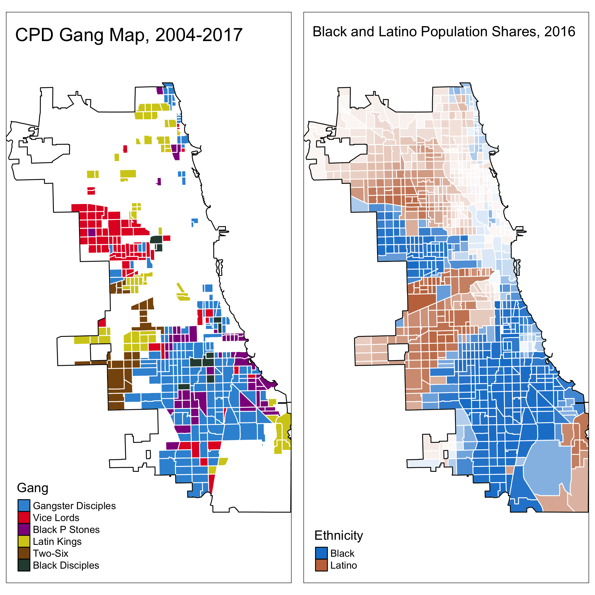
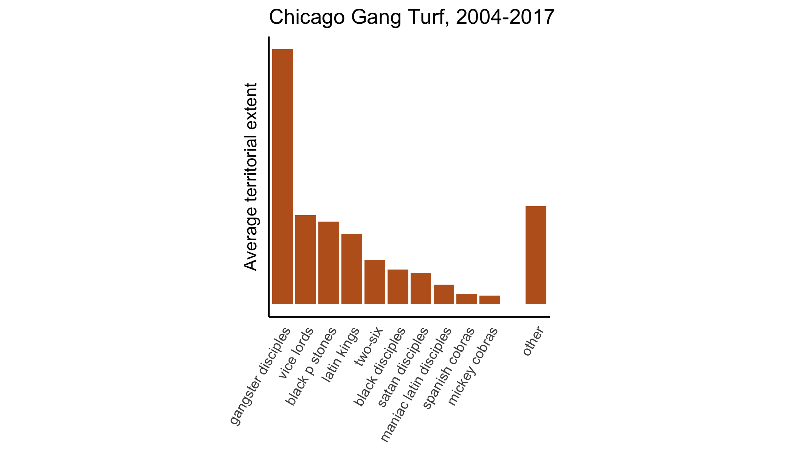
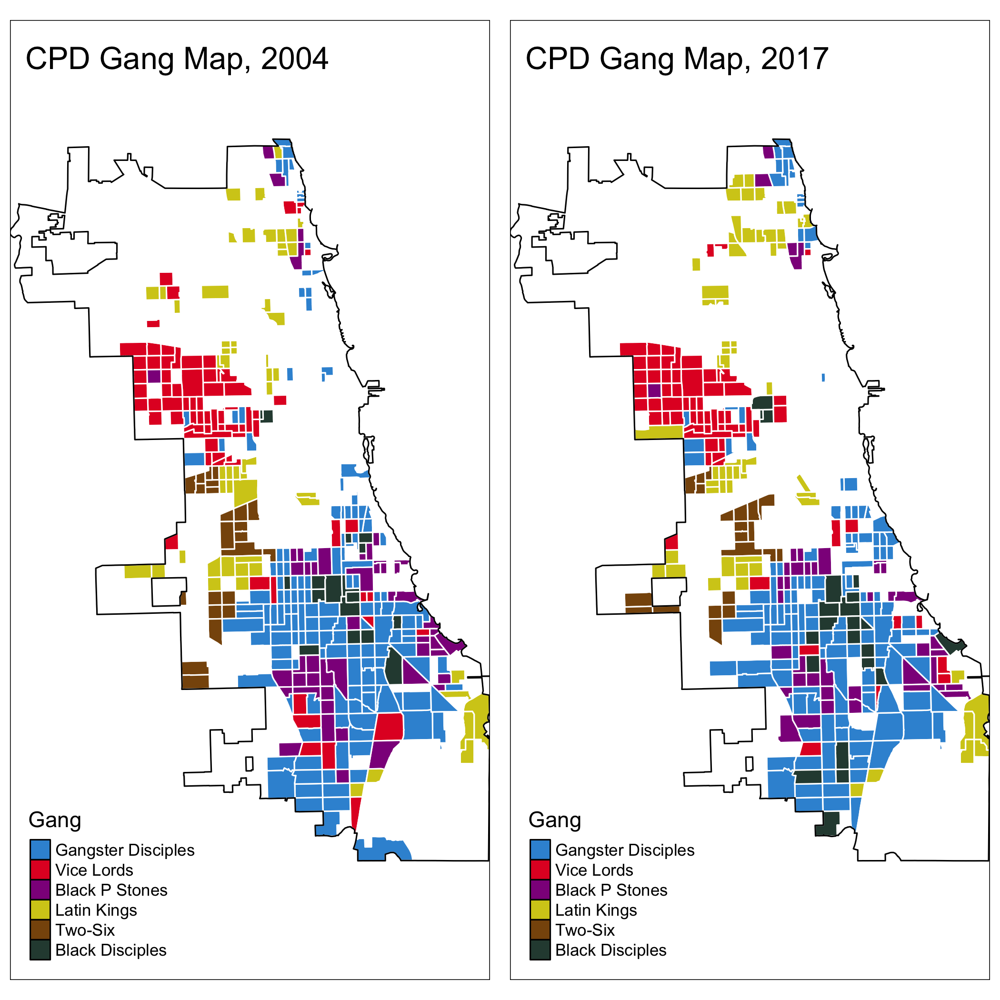
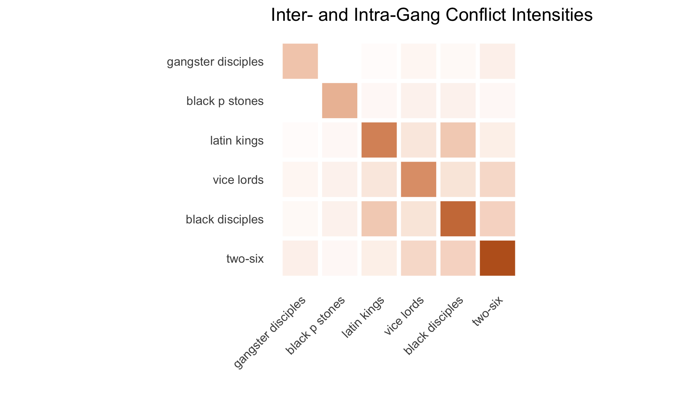

\newpage

# Introduction

In 2019, 2,110 people were murdered or shot in the city of Chicago. Law enforcement agencies and researchers believe much of this violence is connected to street gangs and disputes amongst their members. Between 1994 and 2006, law enforcement officials classified 35-50 percent of Chicago homicides as gang-related [@Papachristos2009; @NDIC2007].^[@Papachristos2009 reports that homicide detectives classified 35 percent of homicides as gang-related in the years 1994, 1998, and 2002. A Department of Justice report claims that 50 percent of Chicago homicides in 2006 were gang-related. According to @Howell2018, these numbers are not unusual -- other large police departments classify between 20 and 50 percent of local homicides as gang-related.] Inter-gang warfare and intra-gang violence feature prominently alongside drug-dealing in many ethnographic accounts of street gangs and their operations [@Sanchez1991; @Decker1996; @Papachristos2009; @Vargas2016]. In one oft-cited case, a gang's monthly costs of protection and aggression —- hiring mercenaries, paying tribute, procuring weapons, and staging funerals —- dwarfed the wholesale costs of all drugs sold by its dealers [@Levitt2000].

Gangs operate over well-defined territories from which they extract rents through racketeering, drug-selling monopolies, and other criminal activity [@Thrasher1927; @Sanchez1991; @Levitt2000; @Venkatesh2000]. Gangs war with one another over control of these rent streams and in response to challenges to their individual or collective reputations [@Brantingham2012; @Papachristos2013; @Ebdm2018]. Anecdotal evidence suggests that such wars are frequent and are a major source of gang-related violence [@Levitt2000]. However, our knowledge of gangs and their territorial footprints remains largely anecdotal because gangs are necessarily covert and opaque organizations. Information on gang activities or territories from law enforcement agencies is generally unavailable either because it is uncollected or because it is not shared with the public.^[The Chicago Police Department's gang maps are the most well-known and are available to researchers thanks to Freedom of Information requests by @Bruhn2019.] When such data are collected and shared, they may be subject to various reporting biases and often come without the metadata necessary to assess the methods by which they were collected [@Kennedy1996; @Levitt1998; @Carr2016]. Existing open-source methodologies used to estimate gangs' territorial footprints require deep subject matter expertise that make them difficult to generalize beyond their target locale [@Sobrino2019; @Melnikov2019; @Signoret2020].

In this paper, we propose and implement a method to estimate the number of gangs operating in a given location and their territorial footprints. Our approach requires the analyst observe only the location and timing of all (gang-related and non-gang related) violent events within the area under study —- data that are widely available in administrative records on crime. We apply this method to study gangs in Chicago, a city in which a panel of gang maps produced by the Chicago Police Department (CPD) are publicly available [@Bruhn2019]. We detect the presence of 3 gangs on average, whose estimated territorial footprints correspond roughly to those of the Gangster Disciples, the Black P Stones, and the Vice Lords. While these constitute a small fraction of all gangs operating in Chicago, they are among the largest by membership and territorial extent. Together, these gangs own 57.3 percent of all gang turf in the city, according to CPD maps.

We begin by modeling the data-generating process for violent events, distinguishing between  non-gang, intra-gang, and inter-gang violence. We assume that gangs have been assigned to territories according to an unobserved partition function. In any given period the amount of violence experienced in a particular gang's territory is a function of independent shocks. The level of intra-gang violence is determined by a shock that is common across each gang's territory, producing a pattern of violence that is common across its domain. Likewise, the level of inter-gang violence experienced by any two gangs is the product of a bilateral shock, producing a pattern of violence that is common across both gangs' terriotries. By contrast, we assume that non-gang violence exhibits no spatial correlation. We show that this model generates a distinct pattern of spatial covariance in violent events and prove that this is a sufficient statistic for the underlying territorial partition. We estimate the model on the observed spatial covariance in homicides and non-fatal shootings across Census tracts in Chicago from 2004-2017 using data from victim-based crime reports from the Chicago Police Department (CPD). The model follows @Trebbi2019 closely. Our innovation is to generalize their approach, used to study terrorist groups in Afghanistan and Pakistan, to a setting featuring bilateral conflict between violent organizations.

Methodologically, this framework is closely related to the literature on stochastic block models (SBMs) as originally proposed by @Holland1983. This literature assumes that actors (nodes) are partitioned into communities. The probability that any two nodes form an edge is a Bernoulli random variable that is specific to each community-dyad. In our case different districts of the city correspond to different nodes, with districts belonging to the same gang forming a community. Our adjacency matrices are the continuous spatial covariance matrices describing the likelihood that shootings occur in a pair of locations during the same period.^[The model of @Trebbi2019 is akin to a special case of the SBM in which actors only interact (commit acts of violence) with members of their own community. In our model, interactions occur both within and between the underyling communities (gangs in our case)] Various methods have been developed for "community detection" -- estimating the underlying communities from observed interactions [@Copic2009; @Jin2015].

We estimate the number of gangs and the division of territory amongst them separately. Holding the of gangs fixed, we estimated the territorial partition via spectral clustering which relates the eigenvectors in our observed spatial covariance matrix to those of the "true" estimand [@Luxberg2007; @Lei2015]. This renders the estimation problem solvable via k-means clustering.^[@Lei2015 provide conditions under which these estimators are asymptotically consistent for the parameters of the SBM *in the number of nodes*. We are not aware of any papers studying the properties of these estimators, applied to the covariance matrix, in the number of *periods*.] We recover the number of gangs through a sample splitting technique designed for the SBM framework @Chen2018.^[Here we also depart from the approach of @Trebbi2019, who employ permutation tests on the geographic proximity of within-community locations to estimate the number of communities. Given the strong non-convexity of gang territory in Chicago [@Bruhn2019], we sought a more flexible approach.] Specifically, we estimate the distribution of territory on rectangular subsets of the covariance matrix and attempt to predict the held-out covariances under different assumptions about the underlying number of communities. With both the number of gangs and the division of territory between them, we can also produce estimates for the parameters relating to the intensity of between- and within-group conflict. 

We quantify the uncertainty surrounding the territorial partition and these parameters through non-parametric bootstrapping, sampling the set of homicides and non-fatal shootings with replacement and re-estimating the number of gangs and the territorial partition amongst them. We permute our most-likely census tract labels to best-approximate a smoothed (over time) map of gang territories and peaceful tracts produced by the CPD. We then compare our estimated partition to the CPD gang maps. In 95 percent of bootstrap iterations, 56-60 percent of our census tract labels agree with those of the CPD.^[These agreement ratios are constructed by permuting our labels to most-closely match those of the CPD.] Random permutations of the CPD's labels produce agreement in only 35 percent of cases. 

Substantively this paper joins a growing literature seeking to measure the territorial distribution of gangs. Previous work has relied on mixed method techniques which seek to invest human capital in gathering information though archival work or interviews. @Signoret2020 successfully use such methods to map cartel presence in Northern Mexico and @Blattman2019 in Colombia. However, these methods are very costly and only produce results limited to a particular locale. Some researchers have sought to automate this process via natural processing techniques, sacrificing accuracy in favor of speed. For example, @Sobrino2019 uses text analysis techniques to produce a dichotomous measure of cartel presence for Mexican cities. By contrast, our method is both granular and low cost.

The paper proceeds as follows. We first describe the crime data and CPD gang maps, used for estimation and validation, respectively. Section III introduces our model and derives the spatial covariance structure used for estimation. We develop our estimators for the number of gangs and the territorial partition in Section IV. We present our results and validate them on the CPD gang maps in Section V before concluding.

# Data

For reports on violence, we rely on victim-based reports from the CPD's online data portal.^[We choose to use victim-based crime reports because they provide the best coverage. When dealing with victim-based crime-reporting, the primary concern is that crimes go under-reported. While under-reporting is likely to be a concern in any dataset on crime, there are two concerns which aggravate the bias in our data. First, the crimes we are interested in are those committed by one criminal organization against another, thereby reducing the probability of reporting.  Second is the fact that gangs often exist in areas where members of that racial minority comprise the majority [@Bruhn2019]. It is well documented that racial minorities in the US have relatively lower levels of trust in police which is likely to translate to under-reporting of crimes [@Desmond2016]. Though other measures of violence do ot suffer these short-comings (e.g. @Carr2016), they are available only for narrow time windows.] Each report of a crime contains an Illinois Uniform Reporting code (IUCR) classifying the crime, a date, and a latitude and longitude for each event. We subset the data to focus solely on homicides and gun crime, including first-degree murder, second-degree murder and aggravated battery involving use of a hand-gun or firearm. In data spanning from 2004 to 2017, there are 32,236 such instances of violence. Violence does not follow a uniform spatial distribution as can be seen in the Figure \ref{fig:hnfs}. As is typical in such administrative data, there is no information available about whether individual crimes were committed by gang-members.

To generate our "districts" we use the division of Chicago into tracts by the US American Community Survey. Census tracts are the second smallest statistical unit, containing approximately 4,000 people and 1,600 housing units.^[This definition is taken from the census glossary.] There are 861 census tracts in Chicago. We aggregate our data by month, so that each individual observation is a count of the amount of violence in a given census tract for a given month. Our data covers Chicago in the years 2004 to 2017 in order to mirror @Bruhn2019 against whom we validate our results. Because census tracts have minor changes from year to year, we fix our districts as they were in 2016. In the course of our sample period, 55 gangs operated in Chicago, according to the CPD.^[We aggregate some gang factions into their larger units, such as the Vice Lords, consistent with @Bruhn2019. This quantity refers to the number of gangs remaining after our aggregation procedure.]

The problem with the use of census tracts as an exogenously generated district is that it does not conform with the building blocks used by gangs to construct territories. Anecdotal evidence suggests that gangs fight for and control of blocks [@Levitt2000]. Census tracts aggregate multiple blocks into a single geographic unit. By using census tracts, we reduce the variance of our estimates but introduce the potential for bias in two ways. First, it is possible that a gang’s territory is assigned to a tract that contains "peaceful" areas, i.e. those uninhabited by gangs. Because peaceful areas are assumed not to produce violence in any systematic way, a census tract which incorporates gang territory and peaceful areas will not have the violence from the peaceful area affect the assignment of the territory to the correct gang cluster. However, our method will mistakenly assign the peaceful areas to the gang. Conversely if the amount of territory owned by a gang in the tract is small, then it is possible that its territory will be designated a "peaceful" tract. For purposes of cross-validation we focus on the 6 largest gangs reported by the CPD. We consider a tract to be owned by the gang owning the largest share of that tract provided it exceeds ten percent of the total area, averaged over the sample years.^[39 gangs satisfy this criteria in the full sample.]

Second, it is possible that a tract may comprise territory owned by two gangs. In this case, not only will territory necessarily be distributed incorrectly, it is possible that the algorithm will be unlikely to distinguish between the two gangs. This is more likely to occur for the smallest gangs given the very fractured territorial distribution of gangs in Chicago [@Bruhn2019]. To deal with this issue we bootstrap our estimation and produce an uncertainty measure for each tract with regards to its ownership.

Two important features of gangs are captured by the model but are not explicitly incorporated into the data-generating process. First, gangs in Chicago are loosely organized in two alliances: the “Folks” and “People” Nations. Our data does not incorporate assumptions as two whether two gangs are allied or not, though this is potentially captured by measures of the conflict intensities. Our measures are imprecise but provides no evidence indicating the existence of these alliances. The Black P. Stones, Vice Lords, and Latin Kings, members of the People Nation were not more likely to fight with the Gangster Disciples, members of the Folk Nation.  Second, gangs are often racially homogenous, and control minority-majority areas. Moreover, most inter-gang conflict is intra-racial. The Latin Kings, the largest Latino gang, was the next most likely to be recovered per our estimation procedure, but less reliably so. Figure \ref{fig:cpd_ethnic} compares the distribution of CPD-reported gang territory to the share of blacks and latinos residing in each census tract. Figure \ref{fig:gang_hist} plots the average territorial size of the largest gangs reported by the CPD.

Unfortunately the model is unable to account for the dynamic nature of gang’s boundaries. We assume that gang’s territories are fixed throughout and seek to estimate these boundaries as though they were static. However, if gangs are warring, then it is possible that territory may change hands. Indeed, @Bruhn2019 notes that an average of 29.5 gangs have their boundaries shift in any given year in the period that we examine. We can address this concern in one of two ways. First, we can split the time-series into different estimation periods and see whether or not boundaries differ across the panels. Second, we can treat our uncertainty estimates as measures of contested control, revealing how strong a gang’s grip is on a given territory. Figure \ref{fig:turf_evolution} shows a comparison of the gangs boundaries in the Chicago Police Department’s data in the first and last years of the sample. Despite the turbulence reported by Bruhn and substantial passage of time, the boundaries are qualitatively quite similar in these years. Given that shifts in boundaries are negligible, we opt not to split the sample.^[It is possible that the observed changes are also the result of human error or minor inconsistencies in the construction of the data.]

# Model

In this section we derive our estimand from a model of the data generating process for violence. We do so by distinguishing between different types of violence and calculating the corresponding spatial covariance in violence. Our assumptions are minimal. We take as primitives the probability that individuals engage in violence against one another and take no stance on the strategic processes generating these probabilities.

## Primitives and Assumptions

There are $N$ districts in the city ($i, j \in \mathcal{N} = \left\{1, ..., N \right\}$) each of which has $r_i$ residents. The city is also inhabited by $K$ gangs ($k, \ell \in \mathcal{K} = \left\{1, ..., K \right\}$) each endowed with $m_k$ soldiers. A partition function $\pi : \mathcal{N} \rightarrow \left\{ 0, \mathcal{K} \right\}$ assigns districts to the gangs that control them, where $\pi(i) = 0$ indicates the absence of any gang activity. $\mathcal{N}_k$ is the set of districts controlled by gang $k$ and $n_k = | \mathcal{N}_k |$ the number of districts controlled by gang $k$. The set of unoccupied districts is $\mathcal{N}_0$. We are interested in estimating the number of groups, $K$, and the territorial partition, $\pi$.

We observe data on geo-located shootings for $T$ periods, indexed $\left\{ 1, ..., T \right\}$. There are three types of shootings that occur in the city -- inter-gang, intra-gang, and non-gang. Let $y_i^t$ denote non-gang shootings in district $i$ during period $t$ and $x_i^t$ denote gang-related shootings in the same district-period. Non-gang shootings are committed by residents with probability $\eta_i$ and are independent across districts. Then, the expected number of shootings in district $i$ is $\eta_i r_i$ with variance $\psi_i = \eta_i (1 - \eta_i) r_i$.^[In other words, non-gang shootings are distributed i.i.d. binomial.]
  
Gang-related shootings are determined by the geographic distribution of gang activity and the state of relations between and within gangs. Members of the same gang sometimes commit violence against one another. The probability a member of gang $k$ shoots a member of his own gang during period $t$ is given by $\xi_k^t$. Assumption 1 states that the expected likelihood of such violence is non-zero.

**Assumption 1:** $\E [ \xi_k^t ] > 0$ for all $k \neq 0$ and $\xi_0^t = 0$ for all $t$.

We also assume that conflict within gangs is unrelated to within-gang conflict between other gangs.

**Assumption 2:** $\E [ \xi_k^t \xi_{\ell}^t ] - \E [ \xi_k^t ] \E [ \xi_{\ell}^t ] = 0$ for all $k \neq \ell$.

We impose no other restrictions on the distribution of intra-gang shocks. The possibility of intra-gang violence allows us to distinguish between districts owned by the same gang and districts whose owners exclusively war with one another.^[Alternatively, we could assume that gangs fight at least two other groups with positive probability. We view this assumption as less restrictive and more attuned to the data as our results suggest that there is a significant amount of intra-gang violence.]  

Gangs also war with one another with varying intensity. The probability a member of gang $k$ shoots a member of gang $\ell$ during period $t$ is $\epsilon_{k \ell}^t$. We make two assumptions on the distribution of these inter-gang shocks. First, we assume they are quasi-symmetric. This requires that any increase in the likelihood that members of gang $k$ shoot members of gang $\ell$ is accompanied by a proportionate increase in reciprocal violence. Notably, we allow this retaliation propensity to vary at the level of the gang but not the gang-dyad. Second, we assume that shocks between all gangs and unoccupied territory are zero, consistent with the absence of gang activity in these geographic units.

**Assumption 3:** $c_{k} \epsilon_{k, \ell}^t = c_{\ell} \epsilon_{\ell, k}^{t}$ with the normalization $c_1 = 1$. If $k = 0$ or $\ell = 0$ then $\epsilon_{k, \ell}^t = 0$ for all $t$.

Second, we assume inter-gang shocks are independent across gang dyads.^[Of course, the intensity of conflict between any two gangs is almost certainly affected by the broader conflict environment. This assumption is made for purposes of model tractability. In future work, we plan to model the genesis of conflict shocks and perhaps relax this assumption.]

**Assumption 4:** $\E \left[ \epsilon_{k, \ell}^t \epsilon_{m, n}^t \right] - \E \left[ \epsilon_{k, \ell}^t  \right] \E \left[ \epsilon_{m, n}^t \right] = 0$ for $m, n \notin \left\{ k, \ell \right\}$.

We assume the probability a given soldier from gang $k$ is operating in territory $i$ is constant and given by $n_k^{-1}$. This assumption implies that intra-gang violence should be equally distributed throughout its territory. Similarly inter-gang violence should be equally distributed across both gangs' territory. The expected number of gang-related shootings in district $i$ during period $t$ can then be calculated as 
$$
\E [ x_i^t ] = \underbrace{ \frac{m_{\pi(i)}}{n_{\pi(i)}} \E [ \xi_{\pi(i)}^t ]}_{ \text{intra-gang} } + \underbrace{\sum_{k \neq \pi(i)} \frac{m_{\pi(i)}}{n_{\pi(i)}}  \E [ \epsilon_{k, \pi(i)}^t ]}_{ \text{inter-gang} }
$$
The total number of shootings in district $i$ during period $t$ is
$$
v_i^t = x_i^t + y_i^t
$$

## Covariance Structure

We can use the model described above to derive a covariance structure in shootings. Let $a_{ij} = \Cov [ v_i^t, v_j^t ]$ denote the covariance in violence between territories $i$ and $j$. Proposition 1 describes the $a_{ij}$.^[A derivation can be found in Appendix A.]

**Proposition 1:** The covariance in shootings between districts $i$ and $j$ is
$$
a_{ij} = \begin{cases} \sum_{k \neq \pi(i)} \left( 
\left( \frac{m_{\pi(i)}}{n_{\pi(i)}} \right)^2 \Var [  \epsilon_{k, \pi(i)}^t ] \right) +  \left( \frac{m_{\pi(i)}}{n_{\pi(i)}} \right)^2 \Var[ \xi_{\pi(i)}^t ] + \psi_i & \text{if } i = j \\
\sum_{k \neq \pi(i)} \left( 
\left( \frac{m_{\pi(i)}}{n_{\pi(i)}} \right)^2 \Var [ \epsilon_{k, \pi(i)}^t ] \right) +  \left( \frac{m_{\pi(i)}}{n_{\pi(i)}} \right)^2 \Var[ \xi_{\pi(i)}^t ] & \text{if } \pi(i) = \pi(j) \\
\frac{m_{\pi(i)}}{n_{\pi(j)}} \frac{m_{\pi(j)}}{n_{\pi(i)}} \frac{c_{\pi(j)}}{c_{\pi(i)}} \Var [\epsilon_{\pi(i), \pi(j)}^t] & \text{if } \pi(i) \neq \pi(j) \\
0 & \text{otherwise}
\end{cases}
$$

Each line of this equation has a simple interpretation. The first line describes the within district variance of shootings. This quantity is affected by the variance of all types of violence - non-gang, inter-gang, and intra-gang. The first term describes the variance in violence produced by conflicts between the gang occupying territory $i$ and all other gangs. The second term describes the variance in violence produced by conflict within the gang occupying territory $i$. The finally term describes the variance in violence from random (resident on resident) violence. If no gang occupies territory $i$ then the first two terms are zero by Assumptions 1 and 3. The second line describes the covariance between two distinct districts that are controlled by the same gang. These districts all experience the violence produced when gang $\pi(i) = \pi(j)$ fights wars with any other gang. They also experience the internal violence germane to gang $\pi(i) = \pi(j)$. This quantity is zero if the territory is unoccupied by any gang. The third line descibes the covariance in violence between two districts controlled by different gangs. Violence in these districts covaries when the gangs controlling the two districts are at war. If either district $i$ or district $j$ is not occupied by a gang, then the covariance in violence will be zero, indicated by the last line of the equation.

One implication of Proposition 1, is that districts that are owned by the same gang will experience similar patterns of violence. Corollary 1 formalizes the observation that for any pair of districts owned by the same pair of gangs will experience the same covariance in violence in expectation.   

**Corollary 1 (Block Structure):** 

1. If $\pi(i) = \pi(j) = k$ and $i \neq j$ then $a_{ij} = b_{kk}$ constant for all $i, j$.
2. If $\pi(i) = k$ and $\pi(j) = \ell$ with $\ell \neq k$ then $a_{ij} = b_{k \ell}$ constant for all $i, j$.

If the partition function $\pi$ is known then the rows and columns of this matrix can be permuted to reveal the block structure described in Corollary 1. Let $A_{N \times N} = (a_{ij})_{ \left\{ i,j \in \mathcal{N} \right\} }$ be the covariance matrix.^[Note also that this matrix is symmetric and positive definite.] Let $A(k, \ell)_{n_k \times n_\ell} = (a_{ij})_{ \left\{ i,j | \pi(i) = k, \pi(j) = \ell \right\} }$ be the submatrix where the row districts are controlled by $k$ and the column districts are controlled by $\ell$. To reveal the block structure, we rearrange district identifiers in accordance with their territorial assignment. Let $f$ be a bijection that maps $\mathcal{N}$ to itself. Specifically, $f$ permutes the district labels such that territories belonging to the same gang will have numerically adjacent labels. 
$$
f: \begin{cases}
\mathcal{K}_k \rightarrow \left\{ \sum_{\ell=1}^{k-1} ( n_{\ell} ) + 1, \dots, \sum_{\ell=1}^{k} ( n_{\ell} ) \right\} & \text{if } k \geq 1 \\
\mathcal{K}_0 \rightarrow \left\{ \sum_{\ell=1}^{K} ( n_{\ell} ) + 1, \dots, N \right\} & \text{if } k = 0
\end{cases}
$$
Then, let $P_{N \times N} = (p_{ij})_{ \left\{ i, j \in \mathcal{N} \right\} }$ be a permutation matrix with $p_{ij} = 1$ if $f(i) = j$ and $p_{ij} = 0$ otherwise. Let $\bar{A} = P A P$ denote the permuted covariance matrix. Then, 
\vspace{5mm}
$$
\footnotesize \bar{A} = \begin{bNiceArray}{CCCCC}
\overmat{\pi(i) = 1}{\begin{bmatrix}
    & & \\
    & A(1, 1)_{n_1 \times n_1} & \\
    & & 
\end{bmatrix}} & \overmat{\pi(i) = 2}{\begin{bmatrix}
    & & \\
    & A(1, 2)_{n_1 \times n_2} & \\
    & & 
\end{bmatrix}} & \cdots & \overmat{\pi(i) = K}{\begin{bmatrix}
    & & \\
    & A(1, K)_{n_1 \times n_K} & \\
    & & 
\end{bmatrix}} & \bm{0} \\
\begin{bmatrix}
    & & \\
    & A(2, 1)_{n_2 \times n_1} & \\
    & & 
\end{bmatrix} & \begin{bmatrix}
    & & \\
    & A(2, 2)_{n_2 \times n_2} & \\
    & & 
\end{bmatrix} & \cdots & \vdots & \bm{0} \\
\vdots & \vdots & \ddots & \vdots & \bm{0} \\
\begin{bmatrix}
    & & \\
    & A(K, 1)_{n_K \times n_1} & \\
    & & 
\end{bmatrix} & \cdots & \cdots & \begin{bmatrix}
    & & \\
    & A(K, K)_{n_K \times n_K} & \\
    & & 
\end{bmatrix} & \bm{0} \\
\bm{0} & \bm{0} & \bm{0}  & \bm{0} & \undermat{\pi(i) = 0}{
\begin{bmatrix}
    & & \\
    & A(0, 0)_{n_0 \times n_0} & \\
    & & 
\end{bmatrix}}
\end{bNiceArray}
$$
\vspace{5mm}

Figure \ref{fig:blocks} shows a schematic representation of this permutation. In the right column blocks and bottom row blocks are districts that are not controlled by any gang. These exhibit no covariance with other districts because the only shootings that occur there are from residents, and these are i.i.d. across districts. Along the block-diagonal are districts owned by the same gang. Shootings within a gang's territory covary for two reasons. First, shocks to within-gang relations ($\xi_k^t$) are shared by all districts controlled by a given gang. Second, members of gang $k$ operating in these districts share equally the risk of attacks that comes from *all* gang wars in which $k$ is a belligerent ($\epsilon_{k, \ell}^t$). On the off block-diagonal are covariances produced through *specific* gang wars. For example, $k, \ell$ block of the matrix is positive whenever $\E [ \epsilon_{k, \ell}^t ] > 0$, or there is a positive probability of conflict between gangs $k$ and $\ell$. The reason that shootings in the districts controlled by gangs $k$ and $\ell$ covary is because inter-gang shocks generate retaliatory violence (Assumption 3).

This covariance matrix can be compactly represented as a function of our estimands, $K$ and $\pi$. Let $\Psi = \text{diag}(\psi_1, \dots \psi_N)$ denote a matrix comprised solely of a diagonal of the covariance generated by the non-gang related violence. Let $Q = A - \Psi$ denote the covariance matrix of the gang-related violence. Let $B_{K + 1 \times K + 1} = (b_{k \ell})_{ \left\{ k, \ell \in \mathcal{K} \right\} }$ store the constant block covariance values defined in Corollary 1 and note that $b_{k0} = b_{0k} = 0$ for all $k$. Finally, let $\Theta_{N \times K + 1} = (\theta_{ik})_{\left\{ i \in \mathcal{N}, k \in \mathcal{K} \cup 0 \right\} }$ be a membership matrix with $\theta_{ik} = 1$ if $\pi(i) = k$ and $0$ otherwise. Then, 
$$
Q = \Theta B \Theta^T .
$$

Readers may recognize this structure as similar in form to a stochastic blockmodel [@Holland1983]. In such models, nodes are partitioned into groups and interact with members of other groups with some latent probability determined by their group membership. These latent probabilities can be expressed in a *connectivity matrix* akin to our $B$. If counts of these interactions are observed, the partition function and connectivity matrix can be estimated using spectral clustering [@Jin2015; @Lei2015]. 

Here, we do not observe directly these interactions, and our $B$ matrix does not have this simple interpretation. However, under the assumptions of our model, the spatial covariance in shootings mirrors the structure of the stochastic blockmodel, as in @Trebbi2019. We can therefore employ existing methods to estimate our model using these data. 

# Estimation

We estimate the territorial partition between groups and the number of groups separately. We first show how to estimate the territorial partition, described by the matrix $\Theta$, holding the number of groups, $K$, fixed. We will then proceed to estimate $K$ using a sample-splitting technique suitable for stochastic block models @Chen2018. Throughout we will denote the desired number of communities with $J = K + 1$ which is the number of gangs and an additional community for the peaceful territory. We will refer to this quantity as the number of clusters.

## Territorial Partition

Given the block structure of our estimand, the number of nonzero eigenvalues in $Q$ is equal to the number of clusters. If there are $K$ gangs in the city, $Q$ will have $J$ nonzero eigenvalues.^[All of the rows of $A$ corresponding to districts owned by gang $k$ will be equivalent and thus linearly dependent.] Spectral clustering relies on this intuition to relate the eigenvalues of the estimand to the eigen-decomposition of the sample analogue.^[@Luxberg2007 provides an overview of this family of methods.] In doing so it transforms the estimation problem to one of k-means clustering. In this section we present these derivations and discuss the properties of the algorithm.

We observe the sample analogue to $A$,
$$
\tilde{A} = \E [A] + \Phi
$$
where $\Phi = (\phi_{ij})_{ \left\{ i, j \in \mathcal{N} \right\} }$ is a noise matrix with $\E[\phi_{ij}] = 0$ for all $i, j$. Note that
\begin{align*}
Q - \text{diag}(Q) &= \E[A] - \text{diag}(\E[A]) \\
&= \tilde{A} - \Phi - \text{diag}(\E[A]) \\
\Phi - \text{diag}(\Phi) &= \left( \tilde{A} - \text{diag}(\tilde{A}) \right) - \left( Q - \text{diag}(Q) \right)
\end{align*}

Let $\mathbb{R}_{+}^{J \times J}$ be the set of all $J \times J$ symmetric matrices with non-negative entries, $\mathbb{D}^{J \times J}$ be the set of all $J \times J$ diagonal matrices and let $\mathbb{M}^{N \times J}$ be the set of all membership matrices.^[These have binary entries with rows summing to 1.] A moment estimator for $\Theta$ and $B$ satisfies
\begin{equation} \label{eq:estimator}
(\hat{\Theta}, \hat{B}) = \argmin_{B \in \mathbb{R}^{J \times J}, \Theta \in \mathbb{M}^{N \times J}} \lVert \Phi - \text{diag}(\Phi) \rVert_F
\end{equation}
where $\lVert M \rVert_F = \left( \sum_{i} \sum_j M_{ij}^2 \right)^{\frac{1}{2}}$ is the Frobenius norm.

Let $\Delta = \text{diag}(\sqrt{n_1}, \dots, \sqrt{n_{J}})$ so that $\Delta B \Delta$ normalizes the connectivity matrix by the number of territories controlled by each group. $Q$ can then be written as
\begin{align*}
Q &= \Theta B \Theta^T \\
&= \Theta \Delta^{-1} \Delta B \Delta \Delta^{-1} \Theta^T \\
&= \Theta \Delta^{-1} Z \Lambda Z^T \Delta^{-1} \Theta^T \\
&= \Theta X \Lambda X^T \Theta^T
\end{align*}
following @Lei2015 (Lemma 2.1), where $\Lambda = \text{diag}(\lambda_1, ..., \lambda_{J})$ stores the nonzero eigenvalues of the normalized connectivity matrix with $| \lambda_1 | \geq \dots \geq | \lambda_{J} | > 0$ and $Z_{N \times J}$ stores the associated eigenvectors. Therefore, $Z \Lambda Z^T = \Delta B \Delta$ is the eigendecomposition of the normalized connectivity matrix. Because $\Theta \Delta^{-1}$ is an orthonormal matrix, the rows of $\Theta X$ remain orthogonal and $Q = U \Lambda U^T$ is an eigendecomposition of $Q$ with $U = \Theta X$.

The noise matrix $\Phi$ will distort the eigenvalues of $\tilde{A}$ away from zero. As $T \rightarrow \infty$, however, this noise matrix becomes small and the eigenvalues that take nonzero values due to noise will shrink toward zero. We therefore eigendecompose $\tilde{A} - \text{diag}(\tilde{A})$ into
$$
\tilde{A} - \text{diag}(\tilde{A}) = \tilde{U} \tilde{\Lambda} \tilde{U}^T
$$
with $\tilde{\Lambda} = \text{diag}(\tilde{\lambda}_1, \dots, \tilde{\lambda}_{J})$ and $| \tilde{\lambda}_1 | \geq \dots \geq | \tilde{\lambda}_{J} | >  | \tilde{\lambda}_i |$ for $i \notin \left\{ 1, \dots, J \right\}$. Then, the problem in \ref{eq:estimator} can be reformulated as
\begin{align*}
\left( \hat{\Lambda}, \hat{X}, \hat{\Theta} \right) &= \argmin_{ \Lambda \in \mathbb{D}^{J \times J}, X \in \mathbb{R}^{J \times J}, \Theta \in \mathbb{M}^{N \times J} } \lVert \tilde{U} \tilde{\Lambda} \tilde{U}^T - \left( \Theta X \Lambda X^T \Theta^T - \text{diag}(Q) \right) \rVert_F \\
&\approx \argmin_{ \Lambda \in \mathbb{D}^{J \times J}, X \in \mathbb{R}^{J \times J}, \Theta \in \mathbb{M}^{N \times J} } \lVert \tilde{U} \tilde{\Lambda} \tilde{U}^T - \Theta X \Lambda X^T \Theta^T \rVert_F
\end{align*}

Setting $\hat{\Lambda} = \tilde{\Lambda}$, the problem reduces to
\begin{equation} \label{eq:kmeans}
\left( \hat{X}, \hat{\Theta} \right) = \argmin_{ X \in \mathbb{R}^{J \times J}, \Theta \in \mathbb{M}^{N \times J} } \lVert \Theta X - \tilde{U} \rVert_F
\end{equation}
which can be solved via K-means clustering on the leading eigenvectors of $\tilde{A} - \text{diag}(\tilde{A})$ where $\Theta$ are the cluster memberships and $X$ are the cluster centroids. An estimate for $B$ can then be recovered as
\begin{equation} \label{eq:B}
\hat{B} = \hat{X} \hat{\Lambda} \hat{X}^T
\end{equation}

Shootings in districts without gangs will exhibit no covariance in expectation with shootings in districts in which gangs operate, $\E[ b_{0k} ] = 0$ for all $k \neq 0$. Once we have estimated $B$, we can therefore isolate the cluster corresponding to no gang activity by finding the row of $\hat{B}$ with the smallest values, formally
\begin{equation} \label{eq:nc}
\min_{ k \in \left\{ 1, ..., J \right\} } \lVert ( \hat{B} - \text{diag}(\hat{B}) )^{(k)} \rVert_2
\end{equation}
where $M^{(k)}$ is the $k$th row of $M$ and $\lVert M^{(k)} \rVert_2$ is the Euclidean vector norm. 

As discussed in the previous section, our model differs slightly from the stochastic block model. Where we observe between district covariance matrix, these models instead work with a binomial matrix of interaction counts between nodes (districts). Efforts to prove the consistency of spectral estimators therefore derive asymptotics as the number of nodes grows large.^[@Lei2015, for example, show that the spectral estimator is approximately consistent for $\Theta$. As the number of groups grows large, the estimator misclassifies a vanishing proportion of nodes with probability approaching one.] Intuitively, the off-diagonal entries of our empirical covariance matrix converge to the off diagonal entries of $Q$ as $T$ grows large. In the limit, then $\tilde{U} \rightarrow \Theta X$ and K-means should not have trouble isolating distinct clusters in $\tilde{U}$. We rely on this heuristic for estimation, like @Trebbi2019.

## Number of Gangs

Several methods exist for estimating the number of clusters when data take the form of a stochastic block model. One set of approaches exploit the intuition discussed in the preceding subsection regarding the eigenvalues of $\tilde{A} - \text{diag}(\tilde{A})$. As $T \rightarrow \infty$, the eigenvalues associated with noise shrink toward zero while those associated with clusters remain positive. This generates a "eigengap" between the eigenvectors associated with true clusters and those associated with noise [@Ahn2013]. We report these and document the existence of such an eigengap. However, we primarily rely on a sample-subsplitting technique to estimate the number of clusters. Both methods produce similiar estimates for $\hat{J}$.

We rely on the cross-validation approach described in @Chen2018 to estimate the number of gangs operating in the city. For each trial $\tilde{K}$, this method iteratively splits the covariance matrix into $V$ rectangular subsets for testing. It then estimates $\Theta$ and $B$ on $V - 1$ subsets and calculates the predictive loss on the square subset of the covariance matrix held out for testing. The $\tilde{K}$ that minimizes predictive loss is chosen as $\hat{J} = \hat{K} + 1$. @Chen2018 provide no theoretical guarantees against overestimating $J$ and in practice, we find that predictive loss stochastically decreases as $\tilde{K}$ grows larger. We therefore select the first $\tilde{K}$ for which predictive loss does not decrease for $\tilde{K} + 1$ as our estimate for $\hat{J}$, averaged over many trial runs of the estimator. Let $\bar{L}_{\tilde{K}}(\tilde{A})$ be the average predictive loss on $\tilde{A}$ when $J = \tilde{K}$ and let $\delta = \left\{ \delta_1, \dots, \delta_{\bar{K}} \right\}$ be a sequence of changes in the predictive loss where $\delta_k = \bar{L}_{k}(\tilde{A}) - \bar{L}_{k+1}(\tilde{A})$. Our estimator for $J$ selects
\begin{equation} \label{eq:hatJ}
\hat{J} = \argmin_{k} \left\{ k \mid \delta_k < 0 \right\}_{k \in \left\{ 1, \dots, \bar{K} \right\} }
\end{equation}

We now describe how this loss function is constructed. Let $\mathcal{V} = \left\{ 1, \dots, V \right\}$ be the set of $V$ cross validation folds, $\mathcal{N}_v \subset \mathcal{N}$ disjoint sets with $\cup_{v \in \mathcal{V}} \mathcal{N}_v = \mathcal{N}$, and $\mathcal{N}_{-v} = \cup_{u \neq v \in \mathcal{V}}$. Let $M^{(u,v)}$ denote the submatrix of $M$ consisting of the rows in $u$ and the columns in $v$. 

We can construct estimates for $\Theta$ from a rectangular subset of $\tilde{A}$, $\tilde{A}^{(\mathcal{N}_{-v}, \mathcal{N})}$. As shorthand, let $\tilde{A}^{(-v, v)} = \tilde{A}^{(\mathcal{N}_{-v}, \mathcal{N})}$. Then,
$$
Q^{(-v, v)} = \Theta^{(-v, v)} B \Theta
$$
and
\begin{align*}
\left( Q^{(-v, v)} \right)^T Q &= \Theta B^T \left( \Theta^{(-v, v)} \right)^T \Theta^{(-v, v)} B \Theta^T \\
&= \Theta B^T \left( \Delta^{(-v, -v)} \right)^2 B \Theta^T .
\end{align*}
An eigendecomposition of this matrix (whose eigenvectors are the right singular vectors of $Q^{(-v, v)}$) can be clustered as above to produce estimates for $\Theta$, which we'll call $\hat{\Theta}(v)$. Then, we can construct $\hat{B}(v)$ by averaging over off-diagonal values of the clusters of the rectangular covariance matrix (excluding the rows in $\mathcal{N}_v$) 
$$
\hat{B}_{k, \ell} = \begin{cases}
\frac{ \sum_{i \in \hat{\mathcal{N}}_{-v, k}, j \in \hat{\mathcal{N}}_{\ell} } \tilde{A}_{ij} }{ \hat{n}_{v, k} \hat{n}_{\ell}} & \text{if } k \neq \ell \\
\frac{ \sum_{i, j \in \hat{\mathcal{N}}_{-v, k}, i \neq j} A_{ij} + \sum_{i \in \hat{\mathcal{N}}_{-v, k}, j \in \hat{\mathcal{N}}_{v, k} } A_{ij} }{ (\hat{n}_{-v, k} - 1) \hat{n}_{-v, k} + \hat{n}_{-v, k} \hat{n}_{v, k} } & \text{if } k = \ell
\end{cases}
$$
as in @Chen2018 Equation 5. Now we can create predicted values for $A$ where
$$
\hat{A}(v) = \hat{\Theta}(v) \hat{B}(v) \left( \hat{\Theta}(v) \right)^T
$$
The predicted loss for the held out block of the covariance matrix can then be calculated as
$$
L_v(\tilde{A}, \hat{A}(v)) = \left\lVert \left( \tilde{A}^{(v,v)} - \text{diag}(\tilde{A}^{(v,v)}) \right) - \left( \hat{A}(v)^{(v,v)} - \text{diag}(\hat{A}(v)^{(v,v)}) \right) \right\rVert_F
$$
The average loss for a trial value $\tilde{K}$ is then
$$
\bar{L}_{k}(\tilde{A}) = \frac{1}{V} \sum_{v=1}^V L_v(\tilde{A}, \hat{A}(v)) .
$$
A sequence $\delta$ can then be constructed for values of $k \in \left\{ 1, ..., \bar{K} \right\}$ allowing us to implement our estimator for $J$ (Equation \ref{eq:hatJ}).

To summarize, our cross validation algorithm proceeds as follows:

1. For each $k \in \left\{ 1, ..., \bar{K} \right\}$,
	- Randomly split districts into folds $\mathcal{N}_1, \dots, \mathcal{N}_V$.
	- For each fold, estimate $\hat{\Theta}(v)$ and $\hat{B}(v)$.
	- For each fold, calculate the predictive loss on $\tilde{A}^{(v,v)}$, $L_v(\tilde{A}, \hat{A}(v))$.
	- Average the predictive loss across folds, $\bar{L}_{k}(\tilde{A})$.
2. Construct the sequence of changes in predictive loss, $\delta$.
3. Select $\hat{J}$ using Equation \ref{eq:hatJ}.

In practice, we repeat this algorithm many times and choose the most frequent value for $\hat{J}$ as our estimate.

# Results

The data cleaning procedure discussed above produces a $N \times T$ matrix of homicide and non-fatal shooting counts for each census tract-month. We construct the covariance matrix $A$ from the rows of this matrix, where each entry $a_{ij}$ stores the covariance in shootings between census tracts $i$ and $j$ over our sample period.^[Some districts experience no shootings over the sample period. We exclude these from the estimation and assign them to the peaceful cluster ex-post.] To quantify the uncertainty surrounding our estimates, we sample the set of homicides with replacement 100 times, reconstruct the count and covariance matrices, and re-run our estimators on the bootstrapped data. This produces sets of bootstrapped estimates for the number of gangs $K$ and associated territorial partitions, $\Theta$. To validate model output, we match each of these bootstrapped estimates to the CPD classifications by permuting their cluster labels to most-closely match those of the CPD. This procedure allows for the possibility that different bootstrap iterations return different sets of matched gangs.^[The procedure also leaves open the possibility that we disagree with the CPD on the identity of the non-gang cluster. In practice, we agree on this quantity in all bootstrap iterations.] For presentational purposes, we aggregate our census tract labels and conflict intensity estimates at the matched-gang level, meaning that the set of gangs for which we assign territory in *some* bootstrap iteration is larger than any bootstrapped estimate for the number of gangs. Uncertainty intervals presented below correspond to 95 percent confidence intervals unless otherwise noted.

\begin{table}

\caption{\label{tab:unnamed-chunk-22}Matched-Gang Counts \label{tab:label_counts}}
\centering
\begin{tabular}[t]{lr}
\toprule
Gang & Proportion\\
\midrule
\rowcolor{gray!6}  Gangster Disciples & 1.00\\
Vice Lords & 1.00\\
\rowcolor{gray!6}  Black P Stones & 0.99\\
Latin Kings & 0.13\\
\rowcolor{gray!6}  Black Disciples & 0.12\\
\addlinespace
Two-Six & 0.05\\
\bottomrule
\end{tabular}
\end{table}

We detect the presence of 3-4 gangs in Chicago. Table \ref{tab:label_counts} reports the frequency with which each CPD-tagged gang is included in the analysis. Following @Ahn2013, we plot the intervals around the leading eigenvalues of the bootstrapped covariance matrices in Figure \ref{fig:scree}. The first several eigenvalues tend to stand out from the remainder, indicative of the presence of unique clusters of gang activity in the data.

These clusters are easily visualized by examining the permuted covariance matrix, the empirical analogue to Figure \ref{fig:blocks}. The right-hand panel of Figure \ref{fig:block_hm} displays the permutation consistent with baseline estimated territorial partition, in which 4 gangs were detected. This matrix is constructed by taking raw covariance matrix (left) and permuting the rows and columns to correspond with the estimated partition. Each square on the right panel highlights the districts controlled with a single gang, with the bottom right block corresponding to districts estimated to have no gang activity. Gang wars generate positive covariance in the off-block diagonal entries. Darker off-block-diagonal entries indicate more intense conflict between the gangs controlling the pairs of districts in question. 

Figure \ref{fig:comparison_map} plots the spatial distribution of estimated gang territory in Chicago (with CPD-reported territories side-by-side for purposes of comparison). Colors indicate which CPD-tagged gang the tract was matched to in the majority of bootstrap iterations. Shading indicates the fraction of iterations for which the tract was matched to a given gang. The estimated peaceful cluster is shown in white to highlight gang turf. We estimate 20-28 percent of the city's census tracts to be gang-occupied. We locate gang activity predominently in the city's West Side and South Side neighborhoods, consistent with CPD assessments. Downtown and North Side neighborhoods are estimated to be free from gang activity in nearly every bootstrap iteration. Like the CPD maps, our estimated gang territories are highly non-convex. 

We confidently assign much of Chicago's West Side to a cluster that mirrors the territory of the Vice Lords (Red). Like the CPD, however, we also detect Vice Lord activity in the city's South Side. These neighborhoods are estimated to be dominated by a gang whose turf approximates that of the Gangster Disciples (Blue). A third cluster interspersed through Gangster Disciple territory also appears frequently, which our matching exercises assigns to the Black P Stones (Purple). Consistent with CPD reports, both of these groups operate in the city's West Side and Uptown neighborhoods. In general, we assign tracts to gangs with less confidence in the South Side. This may be because turf in this area is more contested and fluid than in the West Side [@Bruhn2019]. The CPD reports that all of these gangs have a black identity and our gang turf estimates overlap most frequently with the city's black neighborhoods (see Figure \ref{fig:cpd_ethnic}).

We detect clusters that match to Latino gang turf less frequently. We detect a cluster approximating the turf of the Latin Kings in 13 percent of bootstrap iterations and a cluster mirroring the turf of Two-Six in 5 percent of iterations.

Overall, our tract labels agree with those of the CPD in 56-60 percent of cases. Randomly permuting the CPD's labels produces agreement in only 35 percent of cases. The agreement ratio is highest among peaceful tracts. For tracts we classify as peaceful, the CPD also reports an absence of gang activity 65-69 percent of the time. Among tracts we assign to some gang, our labels agree with those of the CPD in 24-38 percent of cases. This low rate of agreement in this class of tracts is due to two factors. First, both our estimates and those of the CPD classify the vast majority of districts as peaceful. Any subset of the labels is therefore likely to find a large number of peaceful labels in the comparison set. Second, because our estimates for the number of gangs are substantially smaller than the number of gangs the CPD reports, we can only match our labels to a small subset of CPD-reported gangs. Figure \ref{fig:comparison_map} confirms that we capture the distribution of gang activity qualitatively quite well, despite this disagreement. 

So far, we have focused on our results on the estimated partition function, $\hat{\pi}$. Our estimates for $\hat{B}$ describe the intensity of conflict between gangs in our sample. Figure \ref{fig:Bhat_hm} displays the magnitudes of these conflict intensities and Figure \ref{fig:Bhat_ci} plots uncertainty intervals around these point estimates. Some care is warranted in interpreting these results. These estimates correspond to the theoretical quantities defined in Corollary 1. Diagonal entries of this matrix ($b_{kk}$) correspond to the sum of the scaled variance of internal conflict shocks and all scaled inter-gang shocks, where the scaling reflects the size (in membership) of each gang relative to the size of the territory it occupies. This encompasses a larger set of variation than off-diagonal entries, so diagonal entries tend to be larger than off-diagonal entries. Off diagonal entries ($b_{k \ell}$) reflect the size of the inter-gang conflict shocks, scaled by the relative size of the gangs in conflict. Larger values of $b_{k \ell}$ indicate the gangs experience higher-variance conflict shocks, or that the groups are relatively large. 

Relative to the Black P Stones and Gangster Disciples, the Vice Lords' diagonal intensity is quite large. Given that the Vice Lords do not appear to experience larger inter-gang conflict intensity than their peers, this may suggest that they experience relatively large internal conflict shocks. This observation is consistent with the gang's reportedly fragmented organizational structure [@Bruhn2019].^[@Papachristos2009 recounts a war between gangs of the Almighty Vice Lord Nation (AVLN), whose members we aggregate into a single unit for purposes of the present analysis.] Unfortunately, as demonstrated in Figure \ref{fig:Bhat_ci}, inter-gang conflict intensity estimates do not come with statistical precision necessary to make claims about patterns of gang alliance and conflict. We are also unable to estimate the relative size of gang membership given the sparse assumptions of our model. While we get estimates for $n_{k}$, the number of tracts gang $k$ owns, from the partition function, the size of $k$'s membership is not separately identified from the variance of internal conflict shocks. This agnosticism preserves miminalism in the set of asssumptions we adopt while retaining the ability to estimate the number of groups in operation and the territorial partition, the objects of primary interest for this study.

# Conclusion

Conflict within and between street gangs is responsible for much of the interpersonal violence within the United States, but gangs' clandestine nature makes them difficult to study systematically. In this paper, we have developed and validated a method for detecting the presence and territorial extent of these organizations using widely available data. We demonstrated the method's ability to detect and map the territory of the largest gangs operating in Chicago. While the method performs relatively well at this task, it is not able to capture the richness and density of Chicago's gang network, which contains many more organizations than we are able to detect. Moreover, the method necessarily collapses the dynamic process of border conflict and adjustment into a static representation gang territory. The wars we use to detect the presence of gangs and their borders almost certainly move those borders around. While running the estimator on discrete time periods could produce a panel of partition, this would come at the cost of statistical precision. Perhaps this shortcoming could be addressed in part by developing explicitly dynamic models that take into account this process of border change over time. 

Recognizing these measurement limitations, we view this paper as the first step toward studying gang structure cross sectionally. Almost all large municipalities record and report the data necessary to estimate our model, meaning our method can be easily extended to other locales. We are in the process of collecting these data and will report and make public model output when it becomes available. Once estimates of the number of gangs and their territorial partitions have been produced, researchers can study the industrial organization of street gangs cross sectionally. Our uncertainty intervals will allow such studies to explicitly account for measurement error in the input data. We hope that this will facilitate the study of the relationship between gangs, violence, policing, and poverty in America.

\clearpage

# Appendices

## Appendix A: Covariance Derivation

\begin{align*}
\Cov [v_{it}, v_{jt}] =& \E [v_{it} v_{jt}] - \E [v_{it}] \E [v_{jt}] \\
=& \E [ (x_{it} + y_{it}) (x_{jt} + y_{jt}) ] - \E [ x_{it} + y_{it} ] \E [ x_{jt} + y_{jt} ] \\
=& \left( \E [ x_{it} x_{jt} ] + \E [ x_{it} y_{jt} ] + \E [ x_{jt} y_{it} ] + \E [ y_{it} y_{jt} ] \right) - \\
 & \left( \E [ x_{it} ] \E [ x_{jt} ] + \E [ x_{it} ] \E [ y_{jt} ] + \E [ x_{jt} ] \E [ y_{it} ] + \E [ y_{it} ] \E [ y_{jt} ] \right) \\
=& \left( \E [ x_{it} x_{jt} ] -  \E [ x_{it} ] \E [ x_{jt} ] \right) + \left( \E [ y_{it} y_{jt} ] - \E [ y_{it} ] \E [ y_{jt} ] \right) \\
=& \E \left[ \left( \frac{m_{\pi(i)}}{n_{\pi(i)}} \xi_{\pi(i)}^t + \sum_{k \neq \pi(i)} \frac{m_{\pi(i)}}{n_{\pi(i)}} \epsilon_{k, \pi(i)}^t \right) \left( \frac{m_{\pi(j)}}{n_{\pi(j)}} \xi_{\pi(j)}^t + \sum_{\ell \neq \pi(j)} \frac{m_\ell}{n_{\pi(j)}} \epsilon_{\ell, \pi(j)}^t \right) \right] - \\
& \E \left[ \frac{m_{\pi(i)}}{n_{\pi(i)}} \xi_{\pi(i)}^t + \sum_{k \neq \pi(i)} \frac{m_{\pi(i)}}{n_{\pi(i)}} \epsilon_{k, \pi(i)}^t \right] \E \left[ \frac{m_{\pi(j)}}{n_{\pi(j)}} \xi_{\pi(j)}^t + \sum_{\ell \neq \pi(j)} \frac{m_{\pi(j)}}{n_{\pi(j)}} \epsilon_{\ell, \pi(j)}^t \right] + \\
& \left( \E [ y_{it} y_{jt} ] - \E [ y_{it} ] \E [ y_{jt} ] \right) \\
=& \frac{m_{\pi(i)}}{n_{\pi(i)}} \frac{m_{\pi(j)}}{n_{\pi(j)}} \underbrace{\left( \E \left[ \xi_{\pi(i)}^t \xi_{\pi(j)}^t \right] - \E [ \xi_{\pi(i)}^t ] \E [ \xi_{\pi(j)}^t ] \right)}_{ \text{I: intra-gang} } + \\
& \sum_{k \neq \pi(i)} \sum_{\ell \neq \pi(j)} \frac{m_k}{n_{\pi(i)}} \frac{m_{\pi(j)}}{n_{\pi(j)}} \underbrace{\left( \E \left[ \epsilon_{k, \pi(i)}^t \epsilon_{\ell, \pi(j)}^t \right] - \E [ \epsilon_{k, \pi(i)}^t ] \E [ \epsilon_{\ell, \pi(j)}^t ] \right)}_{ \text{II: inter-gang} } + \\
& \underbrace{\left( \E [ y_{it} y_{jt} ] - \E [ y_{it} ] \E [ y_{jt} ] \right)}_{ \text{III: resident violence} }
\end{align*}

We can derive the piecewise equation given in Proposition 1 by considering several cases. We start from the bottom of the piecewise stack. First, assume $i \neq j$ and $\pi(i) = 0$ or $\pi(j) = 0$. Then $\E \left[ \xi_{\pi(i)}^t \xi_{\pi(j)}^t \right] - \E [ \xi_{\pi(i)}^t ] \E [ \xi_{\pi(j)}^t ] = 0$ by Assumption 1 and $\E \left[ \epsilon_{k, \pi(i)}^t \epsilon_{\ell, \pi(j)}^t \right] - \E [ \epsilon_{k, \pi(i)}^t ] \E [ \epsilon_{\ell, \pi(j)}^t ] = 0$ by Assumption 3. $\E [ y_{it} y_{jt} ] - \E [ y_{it} ] \E [ y_{jt} ]$ because resident shootings are i.i.d. across districts. Therefore $\Cov [v_{it}, v_{jt}] = 0$. 

Now consider $i \neq j$ and $\pi(i) \neq \pi(j)$ and $\pi(i), \pi(j) \neq 0$. $\pi(i) \neq \pi(j) \implies \E \left[ \xi_{\pi(i)}^t \xi_{\pi(j)}^t \right] - \E [ \xi_{\pi(i)}^t ] \E [ \xi_{\pi(j)}^t ] = 0$ by Assumption 2. By Assumption 3, $\epsilon_{\pi(i), \pi(j)}^t = \frac{c_{\pi(j)}}{c_{\pi(i)}} \epsilon_{\pi(j), \pi(i)}^t$. By Assumption 4, $\E \left[ \epsilon_{k, \pi(i)}^t \epsilon_{\ell, \pi(j)}^t \right] - \E [ \epsilon_{k, \pi(i)}^t ] \E [ \epsilon_{\ell, \pi(j)}^t ] = 0$ whenever $k \neq \pi(j)$ and $\ell \neq \pi(i)$. Therefore, $\Cov [v_{it}, v_{jt}] = \frac{m_{\pi(i)}}{n_{\pi(j)}} \frac{m_{\pi(j)}}{n_{\pi(i)}} \frac{c_{\pi(j)}}{c_{\pi(i)}} \Var [\epsilon_{\pi(i), \pi(j)}^t]$ where $\Var [\epsilon_{\pi(i), \pi(j)}^t] = \E \left[ \left( \epsilon_{\pi(i), \pi(j)}^t \right)^2 \right] - \E \left[ \epsilon_{\pi(i), \pi(j)}^t \right]^2$.

Next, let $i \neq j$ and $\pi(i) = \pi(j)$. Here, $\E \left[ \xi_{\pi(i)}^t \xi_{\pi(j)}^t \right] - \E [ \xi_{\pi(i)}^t ] \E [ \xi_{\pi(j)}^t ] = \Var [ \xi_{\pi(i)}^t ]$. By Assumption 4, $\E \left[ \epsilon_{k, \pi(i)}^t \epsilon_{\ell, \pi(j)}^t \right] - \E [ \epsilon_{k, \pi(i)}^t ] \E [ \epsilon_{\ell, \pi(j)}^t ] = 0$ whenever $k \neq \ell$. Therefore, the intergang sum condenses to
$$
\left( \frac{m_{\pi(i)}}{n_{\pi(i)}} \right)^2 \Var [ \epsilon_{\pi(i), k}^t ]
$$.

Finally, if $i = j$ then $\pi(i) = \pi(j)$. The within district variance is $\psi_i$. Otherwise, these districts inherit the covariance structure derived in the preceding paragraph. This yields the first component of the piecewise function.

\clearpage

# References

